# Human Approval Is a Queueing System

An enterprise AI agent produces 12,000 proposals a day: record cleanup, refunds, pricing exceptions, data exports, customer messages and account termination. Governance sends every proposal to one approval inbox. By 11:00, 1,900 items are waiting. Reviewers learn that most are harmless, inspect less evidence and approve faster. A routine cleanup now sits ahead of an expiring containment decision. The dashboard still reports a 97% approval rate.

This story was written with AI writing and visualization assistance. All organizations, volumes, probabilities, losses, thresholds, reviewer behavior and service levels are synthetic reference scenarios.

The design error is treating “human in the loop” as a checkbox. Approval is a capacity-constrained decision service: work arrives unevenly, reviewers have different authority, evidence changes decision value and delay can create loss. The production question is not whether a human clicked. It is whether an eligible reviewer received the right evidence and made the decision before its safe operating window closed.

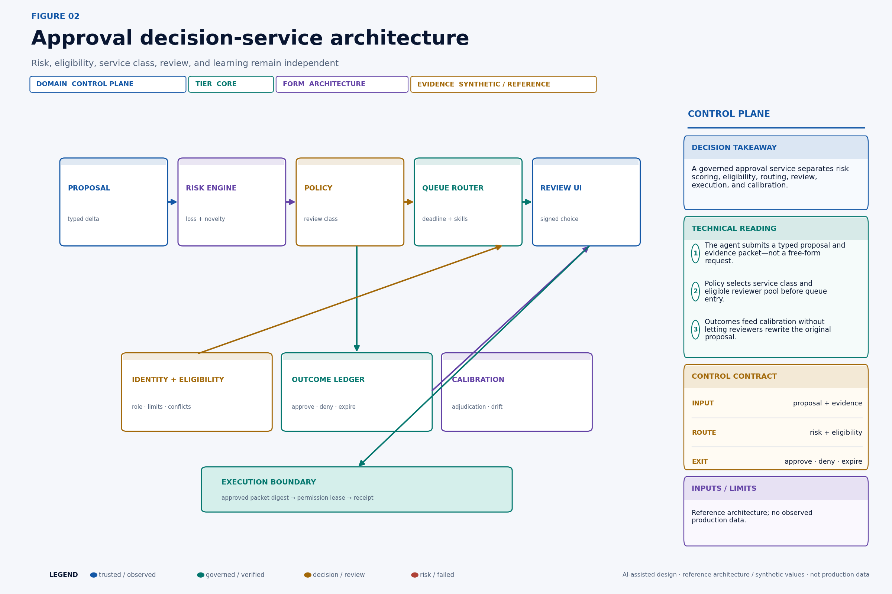

## What this changes in production

- Replace the global approval inbox with explicit service classes and terminal behavior.
- Route only to reviewers who satisfy role, jurisdiction, value-limit and separation-of-duties constraints.
- Bind every decision to an immutable proposal and evidence digest.
- Manage queue age as unresolved risk, not merely backlog volume.
- Use adjudicated outcomes to recalibrate automation and review thresholds.

## Decision table

| Action condition | Route | Deadline behavior | Required proof |
|---|---|---|---|
| Low impact, reversible, strong evidence | Execute under bounded authority | Verify asynchronously | Action receipt and sampled review |
| Moderate impact, non-urgent | Domain review queue | Expire and repropose | Eligible reviewer and evidence packet |
| High impact or time-sensitive | Priority review | Fail safe on missed deadline | Senior limit, exact delta, recovery plan |
| Irreversible or fast-propagating | Incident command | Contain first | Dual control and incident receipt |

## Build an approval decision service

The approval layer should be a shared service with typed APIs and durable state, not a callback embedded in each agent framework. The agent proposes; the service decides how human judgment is acquired and bound.


The **proposal gateway** validates a governed action schema. It rejects vague intent such as “handle this account” and requires a field-level delta, expected resource version, evidence manifest, expiration, and postcondition.

The **risk engine** computes transparent features and categorical flags. It does not make the final authorization decision. The **policy decision point** maps action type, features, organizational risk tolerance, and legal or duty requirements to a review class and obligations.

The **identity and eligibility service** determines which human principals can review this exact action now. Eligibility can change after task creation, so the router and decision endpoint re-evaluate it. The **queue router** assigns priority and candidate pool. It can defer low-risk work, invoke surge capacity, or reject admission when safe service is impossible.

The **review interface** renders an approval packet from structured fields and governed evidence. Approve signs or otherwise integrity-binds the packet digest, decision, reviewer identity, policy, timestamp, and expiry. “Edit” creates a new proposal; it does not mutate the approved one.

The **outcome ledger** records arrival, classification, assignment attempts, open, evidence navigation, decision, expiry, execution, verification, appeal, and adjudication. It supports operations and evaluation while minimizing sensitive behavioral surveillance.

The **calibration service** analyzes disagreement, outcome quality, review value, and subgroup effects. It proposes threshold or policy changes through governance; it does not change production rules automatically.

This architecture aligns with the [NIST AI RMF Core](https://airc.nist.gov/airmf-resources/airmf/5-sec-core/), which describes governance, documented roles, risk tolerance, human oversight, measurement, independent review, and ongoing monitoring as lifecycle activities. The framework does not prescribe this queue design or its thresholds. It supports the principle that human oversight must be defined, assessed, resourced, and documented in context.

## Decompose action-level risk

Review policy should evaluate the action, not merely the model output. A useful feature vector is:

```text
x(a) = [impact, error_likelihood, irreversibility, novelty,
        evidence_weakness, propagation, control_gap]
```

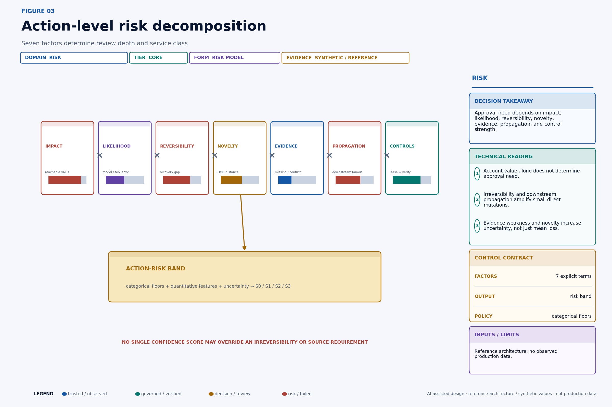

**Impact** includes reachable money, customer commitments, rights, safety, privacy, operational continuity, and reputational consequence. Use distributions or bands when value is uncertain; do not collapse every effect into dollars.

**Error likelihood** conditions on action type, model route, tool chain, evidence pattern, and deployment context. Offline model accuracy is not the same probability that this particular action is harmful.

**Irreversibility** measures more than API rollback. A sent message can be corrected but not unseen. A refunded payment can be recharged but still create customer harm. A data export can be deleted internally but may already have left the boundary.

**Novelty** captures out-of-distribution features: unseen product, jurisdiction, account structure, attachment type, policy combination, tool sequence, or value range. Novelty increases uncertainty even when predicted error remains low.

**Evidence weakness** covers missing required sources, staleness, provenance gaps, contradictions, transformation loss, and model uncertainty. **Propagation** measures how many downstream systems and people can act on the effect. **Control gap** describes missing independent verification, compensation, leased authority, receipt, or containment.

A transparent risk index may support routing:

```text
R = σ(β0 + βI I + βL L + βV V + βN N + βE E + βP P − βC C)
```

`σ` bounds the score. But categorical rules remain necessary: customer data export requires privacy eligibility; an irreversible termination requires senior review; a pricing change above an approved limit requires separation of duties. A low aggregate score cannot override those floors.

Store every feature value, source, transformation, model or rules version, uncertainty, and policy result with the task. If the risk engine changes, replay historical tasks under the old and proposed version before modifying routes.

## Review only when it changes the constrained decision

Human review has positive value when it reduces expected decision loss enough to exceed review cost, delay cost, reviewer residual error, and any opportunity cost. It also has mandatory value when law, policy, contractual duty, or organizational risk tolerance requires it regardless of average economics.

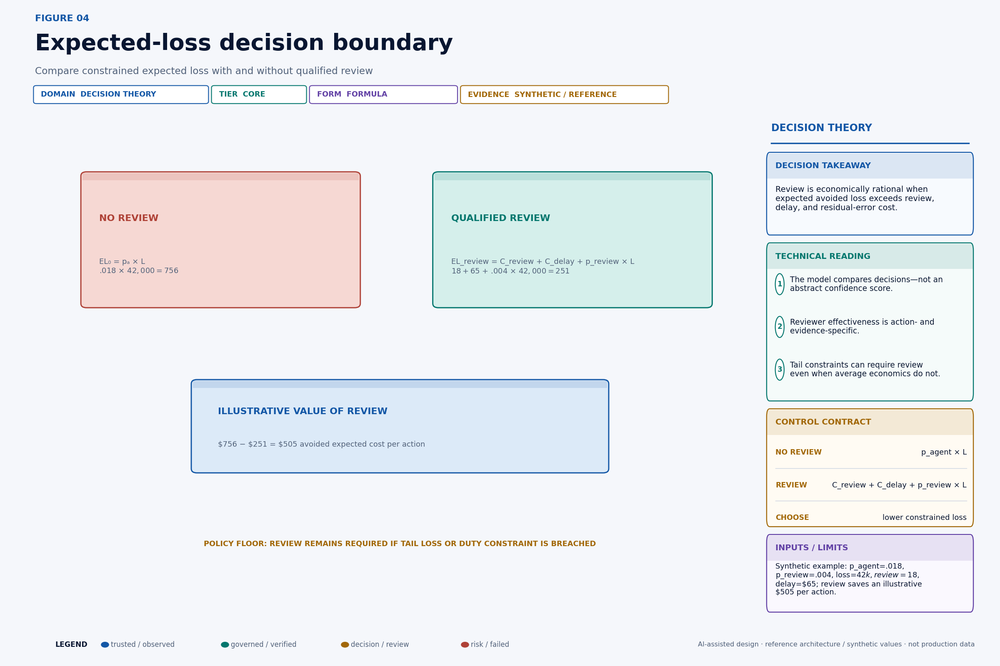

For an action class:

```text
EL(no review) = p_agent_error × L_error

EL(review)    = C_review + C_delay
              + p_reviewer_error × L_error
              + p_review_harm × L_review_harm

Value(review) = EL(no review) − EL(review)
```

Figure 4 uses `p_agent_error = .018`, `p_reviewer_error = .004`, conditional loss `$42,000`, review labor `$18`, and delay cost `$65`. It produces illustrative expected costs of `$756` without review and `$251` with review, or `$505` in value. These are not measured probabilities.

Several corrections matter in production:

- Errors have a distribution, often with a heavy tail. Expected value may hide a rare unacceptable outcome, so add chance constraints or conditional value-at-risk.
- Reviewer performance depends on action type, evidence, interface, workload, and competence. Do not import one “human accuracy” constant.
- Delay changes the action. A pricing opportunity can expire; a containment decision can allow harm to continue; a fraud signal can become stale.
- Review itself can cause harm through inconsistent treatment, unauthorized access, disclosure, or slow service.
- Review can improve future automation through adjudicated labels, but that future value should not justify unnecessary current exposure.

A constrained decision could be:

```text
minimize   labor_cost + delay_cost + residual_expected_loss

subject to P(loss > L_max) ≤ ε
           mandatory_role(action) is present
           separation_of_duties(action) is satisfied
           decision_before(expiry)
```

The organization should document which terms are empirical, estimated, judgmental, or policy-imposed.

## Create explicit service classes

One queue cannot simultaneously optimize a 30-second incident decision and an eight-hour content review. Define service classes with separate admission, priority, reviewer pools, deadlines, and fallbacks.

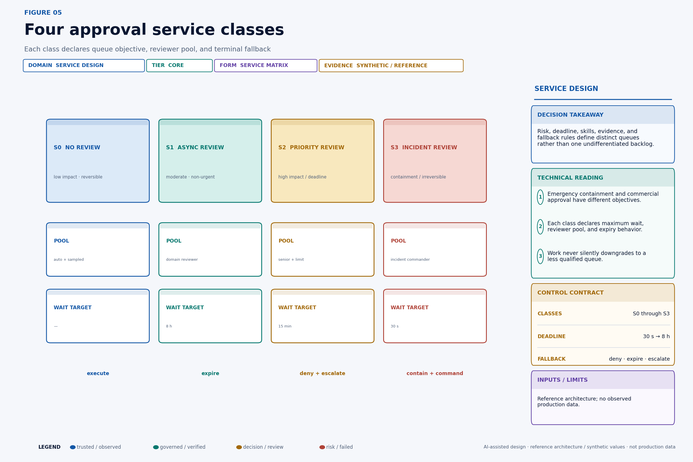

**S0 — no synchronous review.** Low-impact, reversible, well-evidenced actions execute under bounded authority and verification. A statistically designed sample may receive retrospective review. “No synchronous review” does not mean no controls.

**S1 — asynchronous review.** Moderate, non-urgent proposals enter a domain queue with an hours-scale deadline. Expiry denies or regenerates the proposal; it does not leave stale approval open.

**S2 — priority review.** High-impact or time-sensitive actions route to senior reviewers with explicit value limits and a minutes-scale SLO. Capacity is reserved, and low-risk queues cannot consume it fully.

**S3 — incident command.** Containment, irreversible, or fast-propagating actions route to a small eligible command pool with seconds-scale acknowledgement. The decision may be “contain now, investigate next,” supported by break-glass governance and after-action review.

Policy output should be structured:

```json
{
  "service_class": "S2",
  "priority": 87,
  "deadline_at": "2026-08-23T10:57:00Z",
  "required_skills": ["pricing-enterprise", "region-apac"],
  "minimum_seniority": "principal",
  "value_limit": 2500000,
  "separation_rules": ["not-proposer", "not-evidence-curator"],
  "minimum_evidence": ["pricing-policy-z0", "contract-current"],
  "on_expiry": "deny_and_repropose",
  "policy_version": "approval-routing/19"
}
```

Service class is part of the approval receipt. Manual reassignment cannot weaken requirements without a new governed decision.

## Queueing theory reveals the saturation cliff

The simplest diagnostic is an M/M/c queue: Poisson arrivals, exponential service time, `c` identical parallel servers, one class, infinite waiting room, and steady state. Real approval systems violate most assumptions, but the model exposes a crucial fact: delay rises nonlinearly near capacity.

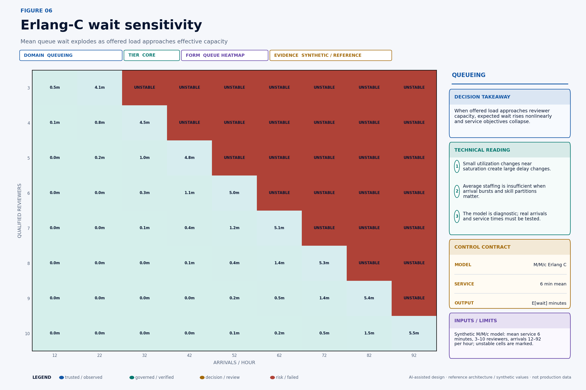

Let `a = λ/μ`, `ρ = λ/(cμ)`, and `ρ < 1`. The Erlang-C probability that an arrival waits is:

```text
                 a^c
              ----------
               c!(1−ρ)
P(wait) = -------------------------
           Σ(k=0 to c−1) a^k/k!
             + a^c/[c!(1−ρ)]
```

Expected queue wait is:

```text
E[Wq] = P(wait) / (cμ − λ)
E[W]  = E[Wq] + 1/μ
```

Figure 6 assumes mean service time six minutes, so one reviewer has `μ = 10 tasks/hour`. Five reviewers offer nominal capacity 50/hour. At 42 arrivals/hour, utilization is 84% and expected queue wait is about 4.8 minutes under these assumptions. At 52/hour the queue is unstable. Adding one reviewer changes both capacity and delay nonlinearly.

Do not use this heatmap as a staffing plan. Real arrivals are bursty and correlated. Service time is typically heavy-tailed: most reviews are short, while complex cases consume an hour. Reviewers are not identical. Skill and value limits partition capacity. Priorities cause low-class starvation. Breaks, training, meetings, time zones, and attention reduce effective availability. Proposals abandon or expire.

Use empirical discrete-event simulation after the diagnostic. Replay timestamped arrivals, fit service-time distributions by class and reviewer pool, model schedules and eligibility, and test spike, outage, and policy-change scenarios. Preserve uncertainty bands instead of publishing one staffing number.

## Eligibility routing fragments capacity

A reviewer who is available is not necessarily eligible. The routing graph is bipartite: action requirements on one side and reviewer pools or individuals on the other. An edge exists only when every current constraint passes.

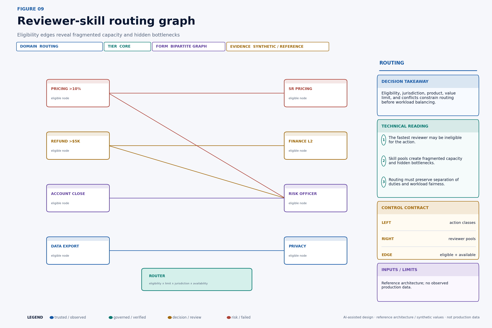

Eligibility predicate:

```text
eligible(task, reviewer, time) =
    active(reviewer, time)
  ∧ trained(reviewer, task.action_type)
  ∧ jurisdiction_allowed(reviewer, task.subject)
  ∧ reviewer.value_limit ≥ task.exposure
  ∧ reviewer.product_scope contains task.product
  ∧ no_conflict(reviewer, task)
  ∧ separation_of_duties(reviewer, task)
```

After hard eligibility, routing can minimize a cost function:

```text
route_cost = α·predicted_deadline_breach
           + β·expected_wait
           + γ·skill_mismatch
           + δ·workload_imbalance
           + ε·context_switch_cost
```

Skill mismatch should not relax a hard eligibility rule. If no reviewer qualifies, the task escalates, expires, or is denied according to policy. The system must expose “no eligible capacity” rather than recording an ordinary delay.

Routing fairness matters. Always selecting the fastest reviewer can overload experienced staff and prevent others from developing competence. Use controlled load balancing, mentoring queues, certification tasks, and quality monitoring without turning high-risk decisions into training exercises invisibly.

## Enforce separation of duties

Human approval is not independent merely because a human clicked. The same person might have requested the action, curated the evidence, configured the policy, issued authority, or verified the result.

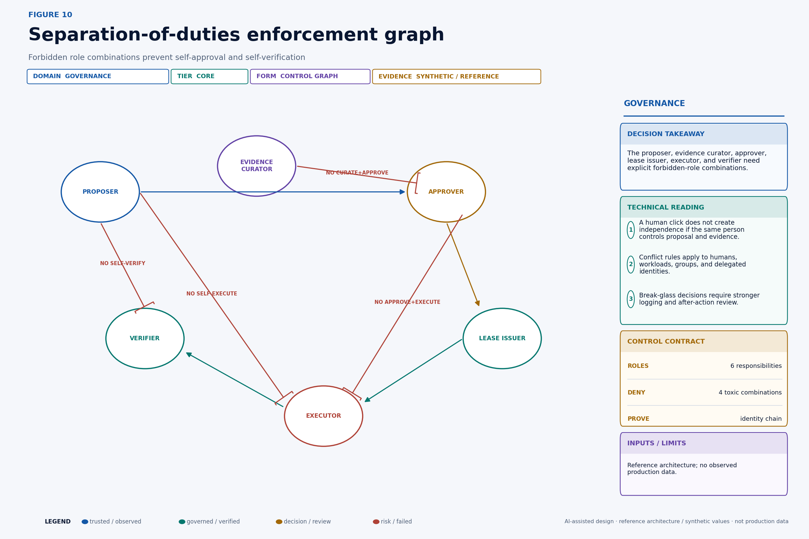

[NIST SP 800-53 Rev. 5](https://csrc.nist.gov/pubs/sp/800/53/r5/upd1/final) includes controls for separation of duties and least privilege, including AC-5 and AC-6. An agent approval service must translate those organizational controls into runtime identity relationships.

Model roles explicitly:

- proposal requester and on-behalf-of subject;
- agent workload and orchestration service;
- evidence curator or source owner;
- policy administrator;
- reviewer and approving authority;
- permission issuer;
- executor;
- effect verifier;
- appeal adjudicator.

Evaluate conflicts across direct identity, group membership, delegation, service ownership, reporting relationships, and recent participation. A reviewer using a second account is still the same person. A service operated exclusively by the proposal team may not provide sufficient independence for high-risk verification.

Break-glass paths are necessary for incidents. They should require a declared emergency reason, stronger authentication, time-bounded authority, immutable receipt, immediate notification, and after-action review by an independent party. Break-glass is not a permanent high-priority queue bypass.

## The approval packet is a decision instrument

Reviewers frequently see a model summary and approve it without inspecting primary evidence. The interface should instead make the exact business decision and its uncertainty legible.

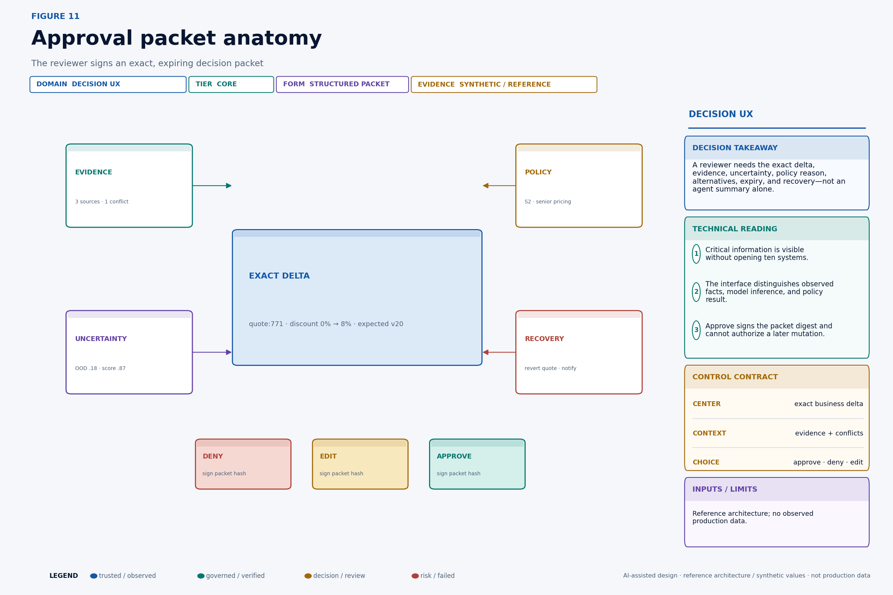

The packet includes:

- exact resource, field delta, current value, expected version, and downstream effects;
- account or case exposure and action risk factors;
- required sources, citations, freshness, provenance, and contradictions;
- model inference and uncertainty clearly separated from observed facts;
- policy result, review class, reviewer eligibility reason, and value limit;
- available alternatives: approve, deny, reduce value, request evidence, abstain;
- expiry and consequences of delay;
- postcondition, verification, compensation, and recovery plan;
- proposal, evidence, and packet digests.

Avoid dark patterns. Approve and deny deserve comparable visibility. Keyboard shortcuts should not make high-risk approval effortless by accident. The UI should surface material changes between versions and never carry a prior approval to an edited proposal.

An approval record can be:

```json
{
  "approval_id": "apr_01JQ8Z...",
  "proposal_id": "prop_01JQ8Y...",
  "proposal_sha256": "sha256:91ab...72e0",
  "packet_sha256": "sha256:c20f...ae17",
  "decision": "approve",
  "limits": {"discount_pct_lte": 8},
  "reviewer": "user:pricing-principal-17",
  "eligibility_policy": "pricing-reviewer/12",
  "routing_policy": "approval-routing/19",
  "decided_at": "2026-08-23T10:51:14Z",
  "expires_at": "2026-08-23T10:57:00Z"
}
```

Execution verifies every digest, limit, identity, deadline, and target precondition before authority is issued.

## Technical deep dive

The following sections retain the quantitative and systems detail for readers implementing the control plane.

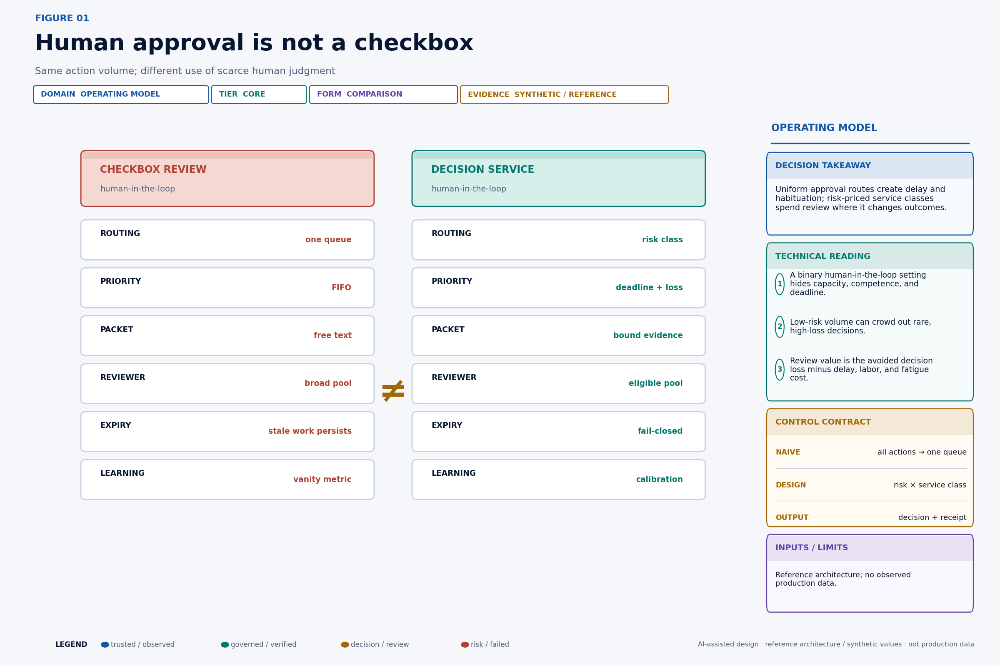

## Optimize thresholds under capacity and risk constraints

Routing threshold determines review volume. Lowering it sends more actions to humans, raising labor and delay while reducing some residual loss. Raising it saves capacity but exposes more automated errors.

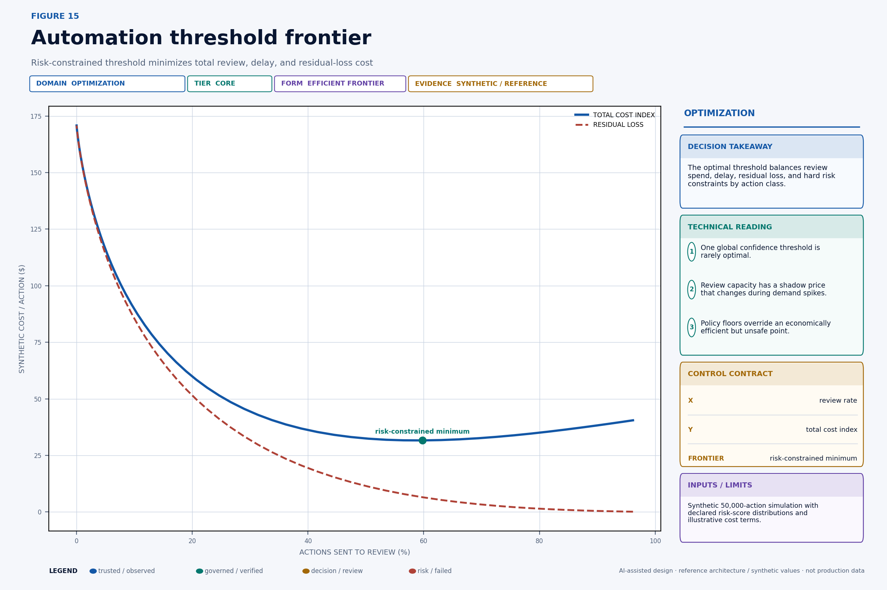

For threshold `τ` and capacity state `q`:

```text
minimize_τ  C_review(τ, q)
          + C_delay(τ, q)
          + E[L_residual(τ)]
          + C_instability(τ, q)

subject to false_autonomy_high_impact(τ) ≤ ε
           P(wait_S2 > 15 min | τ, q) ≤ .05
           mandatory_review_rules satisfied
```

Figure 15 simulates 50,000 actions with synthetic risk scores and cost terms. The point is not its 60% mark. The point is that queue delay makes review cost endogenous: the same threshold can be affordable at 40% utilization and dangerous at 95%. Review capacity has a shadow price.

Thresholds should vary by action class, evidence pattern, reversibility, and reviewer pool. During demand spikes, policy may tighten admission for low-value proposals while preserving mandatory high-risk review. It should not automatically raise the high-risk automation threshold to make the dashboard green.

Evaluate proposed thresholds offline, in shadow routing, and with canary action classes. Compare risk-weighted outcomes and subgroup effects, not only aggregate accuracy.

## Shadow review calibrates the boundary

Before expanding autonomy, run automated decisions and qualified review in parallel without letting the automated branch execute. Later adjudication creates a four-cell operating view.

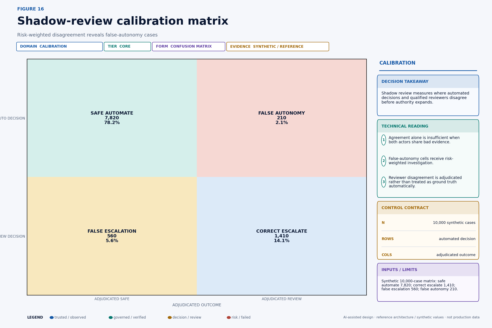

The synthetic matrix has 7,820 safe automation cases, 1,410 correct escalations, 560 false escalations, and 210 false-autonomy cases. Counts alone are insufficient. Weight disagreement by impact and investigate clusters by action, source pattern, model route, reviewer, product, jurisdiction, and novelty.

Reviewers are not automatic ground truth. Two reviewers can share a wrong evidence packet or policy interpretation. Use blinded double review for samples, adjudication rules, appeal outcomes, and authoritative business state where available. Measure inter-reviewer agreement and distinguish genuine ambiguity from poor guidance.

Shadowing also estimates capacity. It reveals service-time distributions, skill bottlenecks, packet defects, deadline pressure, and evidence requests before the queue becomes a production dependency. Protect reviewer time by sampling low-risk actions intelligently rather than duplicating everything forever.

Promotion requires a deployment contract: allowed action slice, maximum exposure, evidence floors, threshold, eligible pools, queue SLOs, false-autonomy budget, appeal path, monitoring, and rollback trigger.

## Production implementation checklist

- Define immutable proposal, packet, decision and outcome schemas.
- Instrument arrival, assignment, open, decision, expiry, execution and adjudication timestamps.
- Create S0–S3 service classes with explicit expiry behavior.
- Enforce reviewer eligibility and forbidden role combinations at decision time.
- Bind approval to proposal and evidence digests.
- Alert on deadline risk, not only queue depth.
- Shadow-test new routing rules before changing autonomy.
- Measure false autonomy, false escalation, reviewer disagreement and appeals separately.

## Continue the Production AI Control Plane series

- [Every AI Agent Action Needs a Receipt](https://singhaditya21.github.io/Medium/articles/every-ai-agent-action-needs-a-receipt/)
- [Your AI Agent Needs a Real Kill Switch](https://singhaditya21.github.io/Medium/articles/your-ai-agent-needs-a-real-kill-switch/)
- [Do Not Let an AI Agent Touch Production Until It Passes This Evaluation](https://singhaditya21.github.io/Medium/articles/do-not-let-an-ai-agent-touch-production-until-it-passes-this-evaluation/)

*Part of the Production AI Control Plane series—practical architectures for agent identity, authorization, governance, observability and recovery.*

*Follow Aditya Singh for production-grade enterprise AI architecture, governance and economics.*
