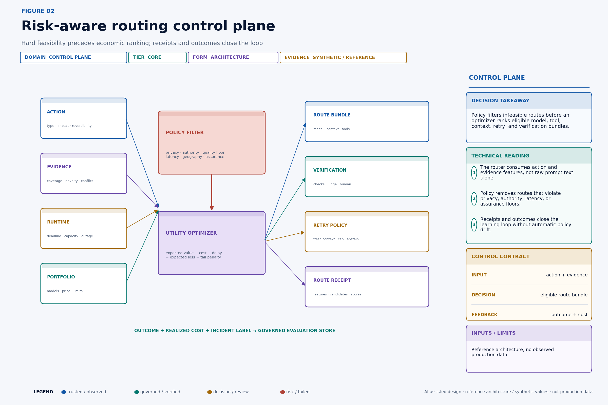
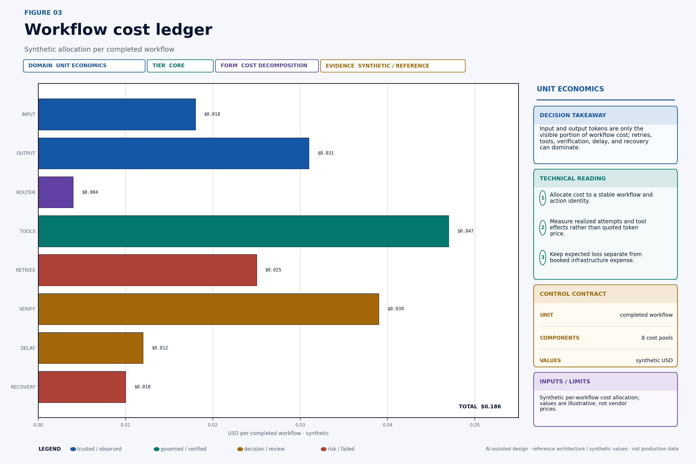
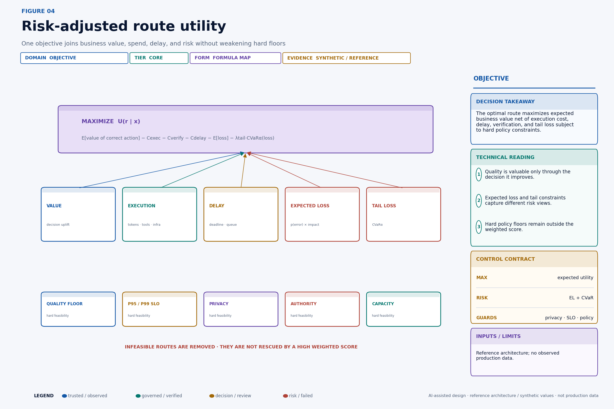
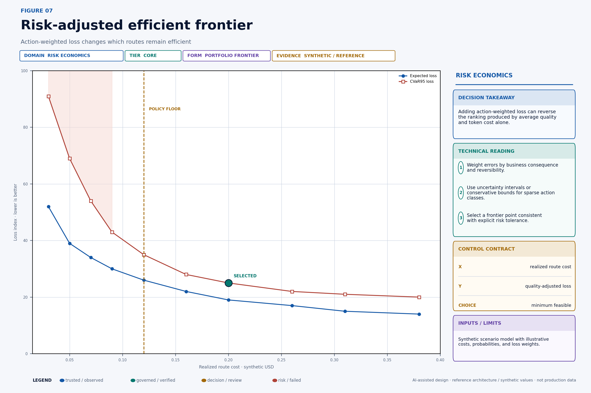
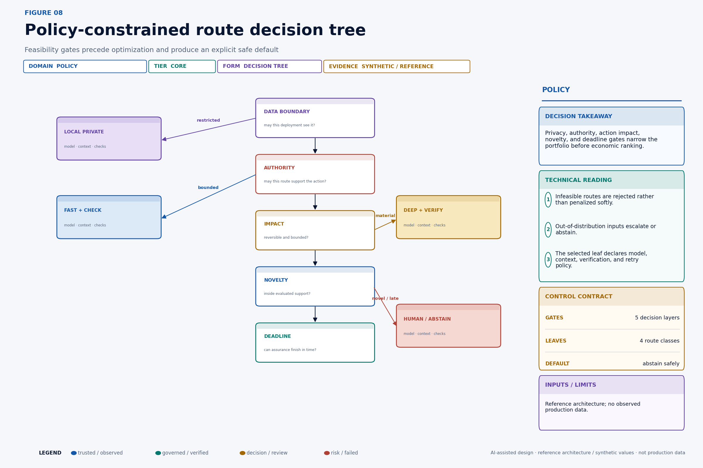
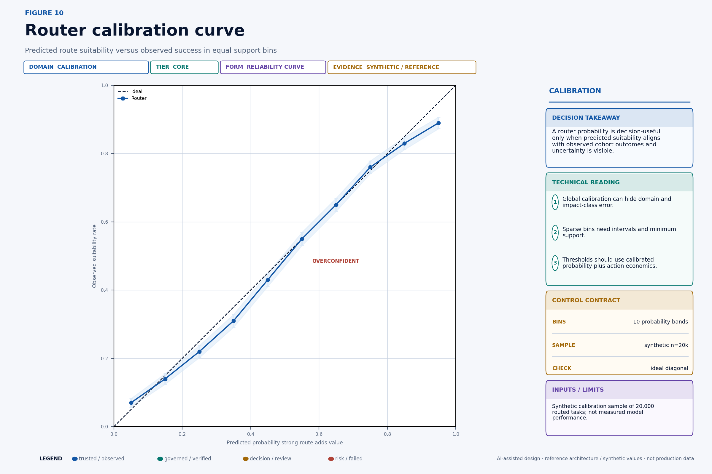
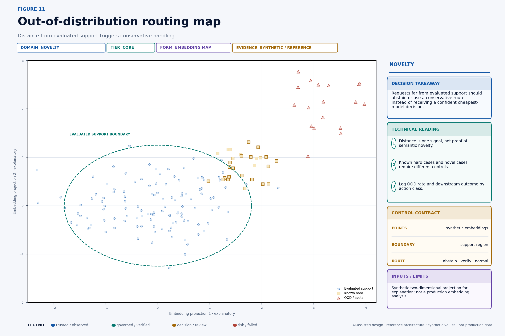
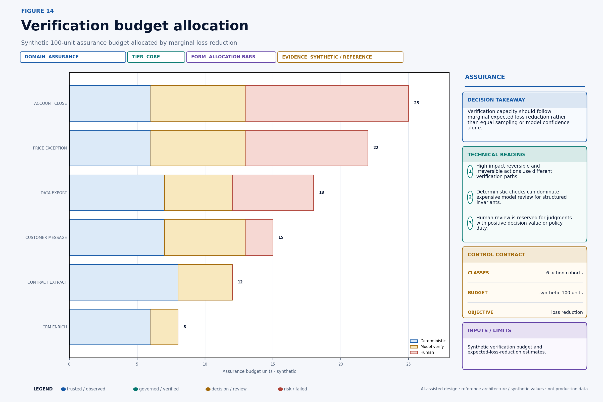
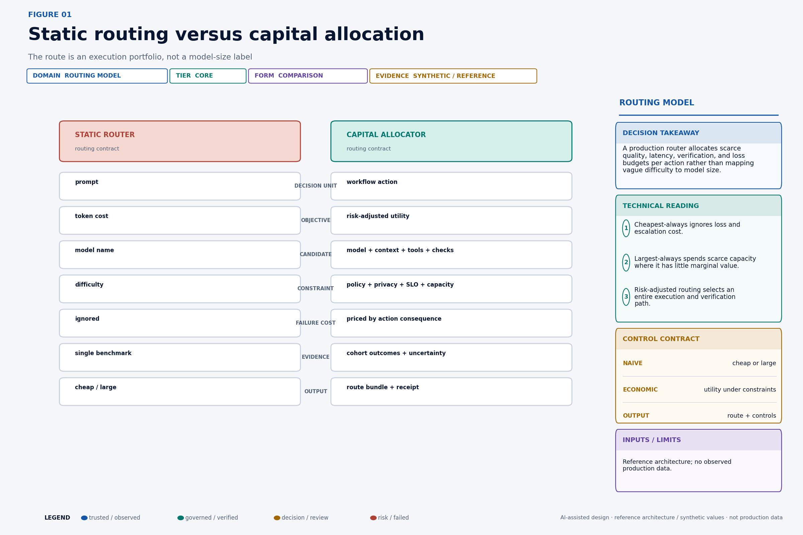
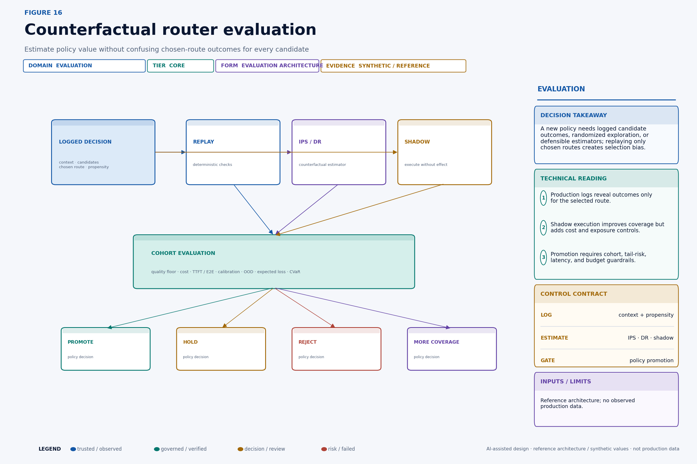

# Model Routing Is Capital Allocation

A production router sends “easy” tasks to a cheap model and “hard” tasks to a large one. That rule looks efficient until a short, syntactically simple request changes a $2.4 million quote while a long, technically complex request only drafts an internal summary. Difficulty is not exposure. Token price is not completed-workflow cost. Average quality is not the loss distribution.

This story was written with AI writing and visualization assistance. All routes, costs, budgets, loss estimates, performance values and charts are synthetic reference scenarios.

Model routing is a capital-allocation problem. Each action competes for a portfolio of model capacity, context, tools, retries, latency and verification. The router must first remove routes that violate policy or cannot satisfy the action’s assurance floor. It should then maximize expected business value net of workflow cost, delay and tail loss—not merely choose the lowest-priced model above a generic score. The output is a governed route bundle with evidence, limits and an accountable decision record.



## What this changes in production

- Route an action cohort, not an isolated prompt.
- Filter policy-ineligible routes before economic optimization.
- Price the completed workflow, including tools, retries, verification, delay and recovery.
- Calibrate route suitability by cohort and abstain outside evaluated support.
- Allocate verification where its marginal expected-loss reduction is highest.

## Decision table

| Routing signal | Wrong shortcut | Production treatment | Output |
|---|---|---|---|
| Action impact | “Prompt looks easy” | Apply assurance and policy floor | Eligible route set |
| Workflow cost | Token price | Include tools, retries, latency and recovery | Expected total cost |
| Quality | Global benchmark | Use calibrated cohort evidence | Suitability distribution |
| Budget pressure | Cheapest model | Use marginal value and hard limits | Governed route bundle |

## Build a routing control plane

The routing control plane should be independent of application prompt code. Applications submit governed action envelopes. A feature service retrieves declared, versioned features. A policy decision point determines eligible deployments and mandatory controls. An optimizer ranks complete bundles. A scheduler reserves capacity and enforces deadline budgets. The inference gateway executes the chosen route. Verification and effect gateways validate output and tools. The receipt store joins decision, realization, and outcome.

This architecture prevents several common failures. Product teams cannot silently bypass the privacy boundary by naming a model directly. A model outage does not cause an arbitrary fallback; the receipt lists eligible alternatives and constraints. A budget alarm cannot downgrade a high-risk action below its assurance floor. A new provider version does not enter consequential traffic without capability and cohort evidence.

The API should return more than a model name:

```json
{
  "route_decision_id": "rd_291",
  "workflow_id": "wf_442",
  "action_id": "act_price_18",
  "policy_version": "router-policy/27",
  "portfolio_snapshot": "portfolio/2026-08-23T10:20:00Z",
  "selected": {
    "deployment": "hosted-deep/eu/v12",
    "context_policy": "pricing-evidence/9",
    "tools": ["policy_lookup", "quote_simulator"],
    "verification": ["schema", "policy", "independent_judge"],
    "max_attempts": 2,
    "on_failure": "human_pricing_queue"
  },
  "excluded": [
    {"route": "hosted-fast/us/v8", "reason": "DATA_REGION"},
    {"route": "local-8b/v5", "reason": "QUALITY_FLOOR_UNPROVEN"}
  ],
  "expires_at": "2026-08-23T10:20:20Z"
}
```

The receipt is an operational and governance artifact. It enables replay under a proposed policy, cost allocation, incident analysis, and explanation of why the apparently cheaper route was excluded.

## Account for the completed workflow

Token price is an input rate, not unit economics. A route can trigger input tokens, output tokens, prompt caching, embeddings, retrieval, reranking, model-based tools, external APIs, retries, replayed context, deterministic verification, model judging, human review, queue delay, compensation, and incident work. Some failed workflows incur cost without producing a completed unit.



Use one stable allocation key across every execution component:

```sql
CREATE TABLE workflow_cost_event (
  event_id          text PRIMARY KEY,
  tenant_id         text NOT NULL,
  workflow_id       text NOT NULL,
  action_id         text NOT NULL,
  route_decision_id text NOT NULL,
  attempt_id        text,
  cost_pool         text NOT NULL,
  quantity          numeric NOT NULL,
  unit              text NOT NULL,
  unit_rate         numeric,
  booked_cost_usd   numeric,
  event_time        timestamptz NOT NULL,
  price_version     text,
  source_receipt    text NOT NULL
);
```

The denominator must be explicit. `cost per request` hides retries and incomplete work. `cost per model answer` ignores tool and verification failure. `cost per completed workflow` may hide output quality. A decision-ready view includes cost per attempted action, verified action, successful business outcome, recovered workflow, and value unit such as accepted case, retained account, or prevented loss.

Keep booked expense and expected loss separate. Booked cost can reconcile to invoices and infrastructure. Delay and expected harm are economic estimates with uncertainty. Combining them into one unlabeled “cost” column makes audit and ownership impossible.

The synthetic Figure 3 allocates `$0.018` to input, `$0.031` to output, `$0.004` to routing, `$0.047` to tools, `$0.025` to retries, `$0.039` to verification, `$0.012` to delay, and `$0.010` to recovery. The values are illustrative. The analytical point is that input plus output represent only part of the completed-workflow cost.

## Optimize risk-adjusted utility

The router should maximize the expected value of the business decision, not a context-free accuracy score. A useful objective for route `r` and action features `x` is:

```text
U(r | x) = E[V_correct(r, x)]
         - C_execution(r, x)
         - C_verification(r, x)
         - C_delay(r, x)
         - E[L_error(r, x)]
         - λ_tail × CVaRα(L_error(r, x))
```



`V_correct` represents the incremental business value of a useful correct action. It can be zero for routine compliance work where the objective is loss avoidance. `C_execution` includes all route attempts and tool calls. `C_verification` includes automated and human assurance. `C_delay` prices missed deadlines, queueing, and slower customer response. `E[L_error]` weights route error probability by consequence. `CVaRα` describes the average loss in the worst `1 − α` share of modeled outcomes, useful when average loss understates an unacceptable tail.

Every term needs units and evidence. If utility is dollars, convert latency to a documented business-delay estimate and label judgmental inputs. If the organization is uncomfortable monetizing rights, legal, safety, or reputational outcomes, encode hard constraints and categorical risk limits rather than inventing false precision.

The optimizer can be a rule table, linear program, contextual bandit, learned ranking model, or constrained policy. Complexity is secondary to observability and calibration. A transparent rule that routes all material exports through a private deployment and human privacy review can be superior to a learned scorer with no defensible outcome labels.

[NIST's AI RMF Core](https://airc.nist.gov/airmf-resources/airmf/5-sec-core/) calls for risk management across governance, mapping, measurement, and management, including documented context, expected benefits, costs, risk tolerance, and ongoing monitoring. It does not prescribe this formula. It supports the broader control expectation that economic benefit and risk evidence be documented across the lifecycle.

## Add business loss before selecting the frontier

Average task quality treats a punctuation error and an unauthorized account action as comparable misses. Route economics must condition error value on the action.



For action class `k`:

```text
E[L(r, k)] = Σ_j P(error_type_j | r, k) × Impact(error_type_j, k)
```

Error types should reflect the workflow: unsupported extraction, wrong classification, policy omission, unsafe tool arguments, false claim, privacy disclosure, stale evidence, or inappropriate refusal. Impact can include money, customer remedy, rights, operational load, regulatory duty, and propagation. Use intervals where evidence is sparse.

Tail constraints prevent the optimizer from accepting rare catastrophic exposure in exchange for a small average saving:

```text
minimize C_total(r, k) + E[L(r, k)]

subject to P(L(r,k) > L_max(k)) <= epsilon_k
           CVaR95(L(r,k)) <= tail_limit_k
           quality(r,k) >= quality_floor_k
```

The risk model must not double-count the same consequence in expected loss, CVaR, and a separate penalty without explanation. Run sensitivity against plausible probability and impact ranges. If the route choice flips under small assumption changes, the decision is uncertain and may require more evidence or conservative policy.

## Filter policy before scoring economics

Some constraints are categorical. Restricted personal data cannot move to an unauthorized region. A route without tool authority cannot execute the action. A novel high-impact request cannot inherit a low-risk cohort's evidence. A route that cannot finish required verification before expiry is not eligible.



Implement the filter with explicit reason codes:

```python
def eligible(route, action, runtime):
    reasons = []
    if action.data_class not in route.eligible_data_classes:
        reasons.append("DATA_CLASS")
    if action.region not in route.allowed_regions:
        reasons.append("DATA_REGION")
    if action.type in route.prohibited_actions:
        reasons.append("ACTION_PROHIBITED")
    if route.quality_lcb(action.cohort) < action.quality_floor:
        reasons.append("QUALITY_LOWER_BOUND")
    if route.p99_ms + route.required_verification_ms > action.deadline_ms:
        reasons.append("DEADLINE")
    if runtime.ood_score > action.max_ood_score:
        reasons.append("OOD")
    return not reasons, reasons
```

Use a lower confidence bound rather than a point estimate for critical cohorts. Re-evaluate feasibility when provider health, capacity, price, policy, or evidence changes. The receipt should show both candidates considered and candidates excluded. Otherwise an incident reviewer cannot distinguish “the optimizer preferred route A” from “route B was unavailable or prohibited.”

## Calibrate predicted suitability

Suppose the router estimates `q = P(strong route adds decision value | x)`. A threshold such as `q > .65` is meaningful only if the probability is calibrated on the deployment cohort. Among cases assigned about `.70`, the event should occur at approximately the expected rate, within uncertainty and definition limits.



Expected calibration error can be summarized as:

```text
ECE = Σ_b (n_b / n) × | accuracy_b − confidence_b |
```

But one global number can hide critical cohort failure. Report calibration by action class, impact band, language, route candidate set, novelty band, and time. Use confidence intervals and minimum support. A bin with 30 observations should not drive a precise high-impact threshold.

Calibration can drift when a candidate model changes, prompt templates shift, business mix changes, tool availability changes, or users adapt. Monitor the feature distribution and the relationship between router score and eventual outcome. Recalibration may repair probability mapping; it cannot repair a feature set that no longer separates useful routes.

Economic thresholds combine calibrated probability with marginal value:

```text
choose strong when

q(x) × ΔV_correct(x)
  + ΔE[loss_reduction(x)]
  > ΔC_execution(x) + ΔC_delay(x) + ΔC_verification(x)
```

Hard policy controls still apply on both sides.

## Detect unsupported requests and abstain

A router is most dangerous when it is confident far from its evaluation support. Novelty can arise from a new domain, schema, jurisdiction, product, language, attachment type, tool combination, context length, adversarial pattern, or business-value range.



No single distance threshold proves semantic novelty. Combine multiple signals: embedding distance, density, classifier uncertainty, schema mismatch, unseen category, evidence missingness, disagreement among routers, high entropy, and explicit policy novelty. Evaluate false-positive and false-negative costs.

Separate **known hard** from **unknown**. A familiar complex tax clause may be inside support and require a deep route. An apparently simple request for a newly regulated product may be outside support. Difficulty and novelty are not synonyms.

OOD behavior should be declared per action class: abstain, use a conservative private route, require independent verification, route to a human, or run shadow-only. Record the novelty signals and later adjudicated outcome. A high OOD abstention rate may indicate safe behavior or poor coverage; operations needs both numerator and business context.

## Allocate verification where it reduces loss

Equal verification sampling is simple but inefficient. Model confidence is also insufficient: high confidence can be miscalibrated, and low confidence on a harmless action may have little business consequence. Allocate assurance capacity by expected marginal loss reduction and policy duty.



For verification mode `v`, action cohort `k`, and route `r`:

```text
MVR(v, r, k) = E[L_without_v − L_with_v]
               − C_v
               − C_delay_v
               − E[L_verifier_error_v]
```

Fund modes with positive marginal verification return, subject to capacity and mandatory controls. Deterministic checks are often cheapest and most reliable for typed schemas, arithmetic, value limits, allowlists, resource versions, and exact citations. A model verifier may help with semantic contradictions or unsupported claims but can share correlated blind spots. Human review adds value for policy judgment, novel high-impact cases, and duties requiring a qualified person; it also adds queueing, variability, and fatigue.

The Figure 14 synthetic allocation uses 40 deterministic units, 31 model-verification units, and 29 human units across six cohorts, totaling 100. It is not a recommended universal mix. A production allocation needs observed error modes, reviewer capacity, deadlines, and action-level loss estimates.

## Technical deep dive

The following sections retain the quantitative and systems detail for readers implementing the control plane.



## Evaluate counterfactual policy honestly

Historical logs reveal outcomes for the route that was chosen. They usually do not reveal what every other model and verification bundle would have produced. Training or evaluating only on chosen-route outcomes creates selection bias: the old policy sent particular cases to particular models.



Safe evidence options include:

- Deterministic replay for rules, feature transforms, policy filters, and stable verifiers.
- Shadow inference that executes candidate models without permitting external effects.
- Randomized exploration among policy-eligible routes for low-risk cohorts, with logged probability of selection.
- Parallel adjudication or human labels on a stratified sample.
- Inverse propensity scoring or doubly robust estimation when assumptions and support are defensible.

For logged action `i`, old-policy propensity `p_i(a_i | x_i)`, new-policy probability `π(a_i | x_i)`, and observed reward `y_i`, the inverse-propensity estimator is:

```text
V_IPS(π) = (1/n) Σ_i [π(a_i | x_i) / p_i(a_i | x_i)] × y_i
```

If the old policy never selected a candidate for a region of feature space, the denominator provides no support and IPS cannot invent the counterfactual. Extreme weights increase variance. Clip only with documented bias trade-offs, report effective sample size, and use doubly robust methods when a credible outcome model is available.

Shadow outputs still need evaluation. A model response judged by another model may encode evaluator bias. Tool calls cannot always run safely in shadow. Customer and downstream effects may be unobservable without controlled experiments. Preserve these limitations rather than promoting on an appealing offline average.

The [MLPerf Inference documentation](https://docs.mlcommons.org/inference/index_gh/) describes a benchmark suite for measuring system inference performance across deployment scenarios. Standardized performance evidence is useful, but enterprise routing also needs action-level end-to-end duration, queueing, tool latency, verification, retries, and business postconditions. Hardware or model throughput is not workflow throughput.

## Production implementation checklist

- Define the action cohort and business postcondition before selecting a model.
- Maintain a versioned portfolio of model, context, tool, retry and verification bundles.
- Record workflow-level cost and outcome, not only token usage.
- Apply policy, privacy, residency and assurance floors before scoring utility.
- Calibrate suitability by cohort and expose uncertainty.
- Add an abstain or conservative route for unsupported requests.
- Log candidate routes for defensible counterfactual evaluation.
- Set separate quality, latency, budget, loss and policy objectives.

## Continue the Production AI Control Plane series

- [What an Agent Actually Costs](https://singhaditya21.github.io/Medium/articles/what-an-agent-actually-costs/)
- [Human Approval Is a Queueing System](https://singhaditya21.github.io/Medium/articles/human-approval-is-a-queueing-system/)
- [Do Not Let an AI Agent Touch Production Until It Passes This Evaluation](https://singhaditya21.github.io/Medium/articles/do-not-let-an-ai-agent-touch-production-until-it-passes-this-evaluation/)

*Part of the Production AI Control Plane series—practical architectures for agent identity, authorization, governance, observability and recovery.*

*Follow Aditya Singh for production-grade enterprise AI architecture, governance and economics.*
