# Your Multi-Agent System Is a Distributed System

Six AI agents coordinate a strategic renewal. Pricing commits an 8% discount and advances the account to version 21. Contract, still reading version 20, submits an incompatible term. Billing commits a schedule change, but its response times out. The workflow retries while a second worker takes over after a lease expires. Every model produced fluent output. The business now has overlapping owners, incompatible truths and an ambiguous charge.

This story was written with AI writing and visualization assistance. The company, traffic, failure rates and economics are synthetic; the diagrams are reference architectures.

Once independent agents can observe and mutate shared business state, the architecture is a distributed system. The control question is no longer “Can the agents collaborate?” It is whether one durable workflow owns the intent, stale owners are fenced, each semantic action creates at most one business effect, concurrent writes respect versions and every ambiguous outcome enters reconciliation instead of blind retry. Conversation quality cannot provide those guarantees. Domain services, workflow state and effect receipts must.

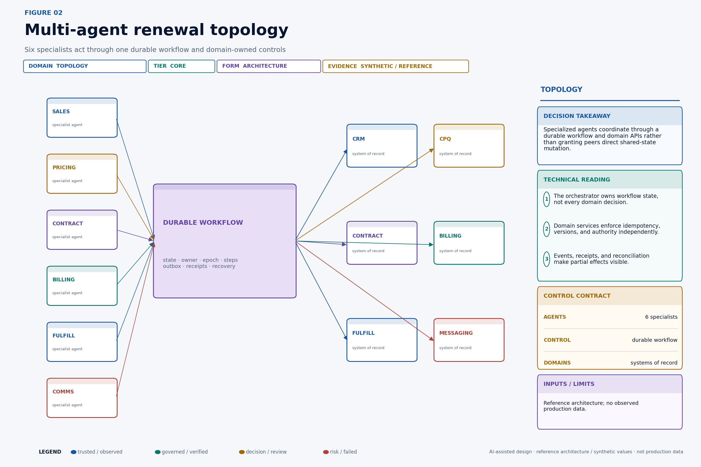

## What this changes in production

- Give one durable workflow—not a chat transcript—ownership of the business intent.
- Separate stable action identity from retry attempt identity.
- Require conditional writes, idempotency and fencing at the domain boundary.
- Treat timeouts after dispatch as ambiguous until authoritative state is reconciled.
- Model cross-domain recovery as a saga with explicit human-remediation states.

## Decision table

| Coordination problem | Required mechanism | Enforcement point | Failure outcome |
|---|---|---|---|
| Worker takeover | Lease plus monotonic epoch | Workflow store and domain gateway | Reject stale owner |
| Duplicate delivery | Stable action ID and idempotency ledger | Authoritative domain | Return recorded result |
| Concurrent mutation | Expected resource version | System of record | Reject and re-evaluate |
| Cross-domain partial completion | Saga and compensation graph | Durable workflow | Reconcile, compensate or escalate |

## Invariants are the real multi-agent interface

Agent prompts describe desired behavior. Invariants describe states the system must never accept or must eventually resolve. Start architecture work by writing invariants in business language, then locate the component that can enforce each one.

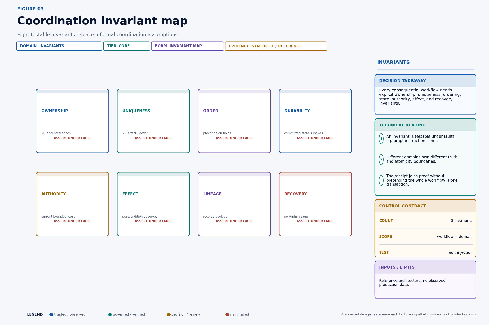

For the renewal scenario, “one owner” is not a statement that only one process is running. Networks can partition and schedulers can pause. The enforceable form is: **for a protected scope, the domain accepts writes only from the highest valid epoch it has observed**. “Exactly once” is similarly misleading if interpreted as a transport guarantee. The useful invariant is: **one action identity produces no more than one semantic effect in the authoritative domain**.

Write each invariant with five fields:

```yaml
invariant_id: renewal.discount.single_effect.v1
scope: tenant/{tenant_id}/account/{account_id}/renewal/{renewal_id}
statement: accepted_discount_effects(action_id) <= 1
enforcer: pricing-domain
oracle: pricing-effect-ledger
recovery_owner: revenue-operations
```

The **enforcer** must sit where the state transition can be accepted or rejected. The **oracle** must distinguish “request observed” from “effect committed.” The **recovery owner** is a person or service accountable when the invariant cannot be automatically restored. If a team cannot name these fields, it does not yet have a production invariant; it has an aspiration.

Some invariants are safety properties: something bad never happens, such as accepting a stale owner. Others are liveness obligations: something good eventually happens, such as every ambiguous charge reaching verified, compensated, or escalated state. Liveness needs deadlines and ownership. “Eventually” without an age objective is an orphan queue.

## A lease is temporary ownership, not proof of exclusivity

Suppose worker A owns workflow scope `account/A42/renewal/R9` under epoch 42. A network partition prevents renewal of the lease, but A remains alive. After expiry, worker B acquires epoch 43. Both can now execute application code. If domain APIs accept whichever request arrives first, the lease did not prevent split brain; it only informed the control plane that ownership changed.

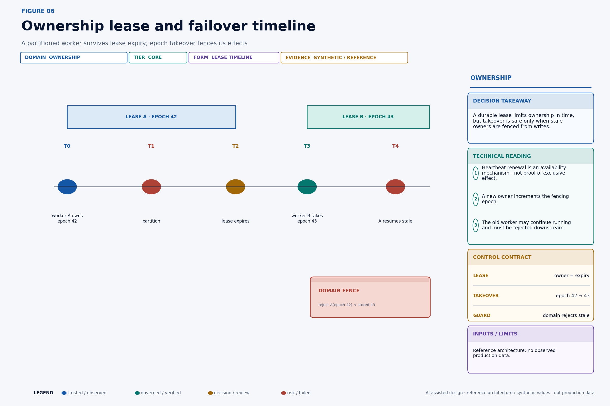

Lease records should include scope, holder, acquired time, renewal time, duration, and monotonically increasing epoch. [Kubernetes Lease objects](https://kubernetes.io/docs/concepts/architecture/leases/) demonstrate production uses of lease-shaped coordination, including node heartbeats and leader election. That documentation is evidence that leases are a practical coordination primitive; it does not make a Kubernetes Lease alone sufficient for business-effect fencing.

A safe renewal rule uses the authoritative lease store's compare-and-swap or transactional mechanism:

```text
renew(holder, lease_id, epoch, now):
  require current.holder   == holder
  require current.lease_id == lease_id
  require current.epoch    == epoch
  require now < current.expires_at
  set current.expires_at = now + duration
```

Clock assumptions must be declared. Use the lease store's time when possible. If clients calculate expiry, bound clock skew and network delay or shorten the useful work window before formal expiry. A worker that cannot confirm ownership should stop initiating new effects and move pending work to an uncertain state. “I did not see a revocation” is not current ownership.

Lease duration creates a trade-off. A short duration reduces stale-owner time but increases renewal load and false takeover during pauses. A long duration improves tolerance for jitter but expands the period before failover. Measure scheduler pauses, store latency, network delay, work duration, and renewal failure. Then select duration and safety margins per action class rather than one platform-wide constant.

## Fencing makes ownership enforceable

Fencing closes the lease gap by putting the ownership epoch on each protected mutation and making the resource domain reject old epochs. The critical control is not “worker A knows it is stale.” It is “pricing refuses worker A even if A still believes it is current.”

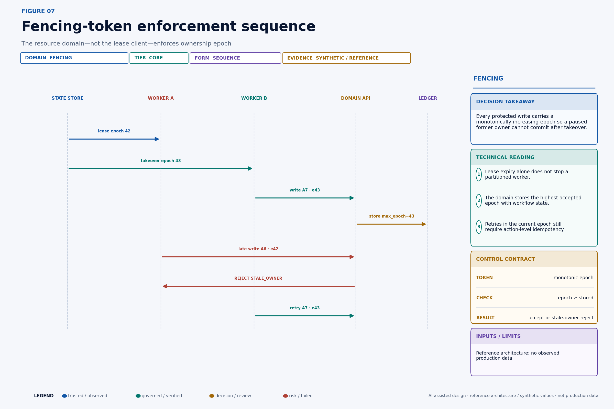

The domain-side check can be expressed as:

```text
apply(command):
  begin transaction
    scope = lock_scope(command.ownership.scope)

    if command.ownership.epoch < scope.max_epoch:
      return STALE_OWNER

    if command.authority is expired or out_of_scope:
      return AUTHORITY_REJECTED

    prior = idempotency_ledger.get(command.action_id)
    if prior exists:
      return prior.result

    if resource.version != command.preconditions.resource_version:
      return VERSION_CONFLICT

    scope.max_epoch = max(scope.max_epoch, command.ownership.epoch)
    result = mutate_resource(command)
    idempotency_ledger.insert(command.action_id, command.digest, result)
  commit
  return result
```

The epoch, resource mutation, and idempotency record must share a sufficiently strong transaction boundary. Otherwise a crash can advance the fence without recording the effect, or commit the effect without recording deduplication. When a SaaS API cannot store epochs, introduce the strongest available guard: conditional versions, scoped idempotency keys, a gateway that serializes the resource, or a reconciliation barrier. Then document the residual split-brain exposure instead of claiming fencing.

Epochs are scope-specific. A single global epoch would serialize unrelated customers and create a huge blast radius. Choose the narrowest scope that contains the invariant: workflow, account, quote, order, or ledger partition. A pricing write and a fulfillment reservation may use different domain fences even when one workflow owns both.

## Transport semantics do not guarantee business semantics

At-most-once delivery can lose a request. At-least-once delivery can duplicate it. Ordered partitions provide local order only within a declared key. A transactional outbox closes one local commit gap but does not create a transaction across the remote domain. “Exactly once” claims are often scoped to a broker or processor and do not prove exactly one customer charge, CRM transition, or email.

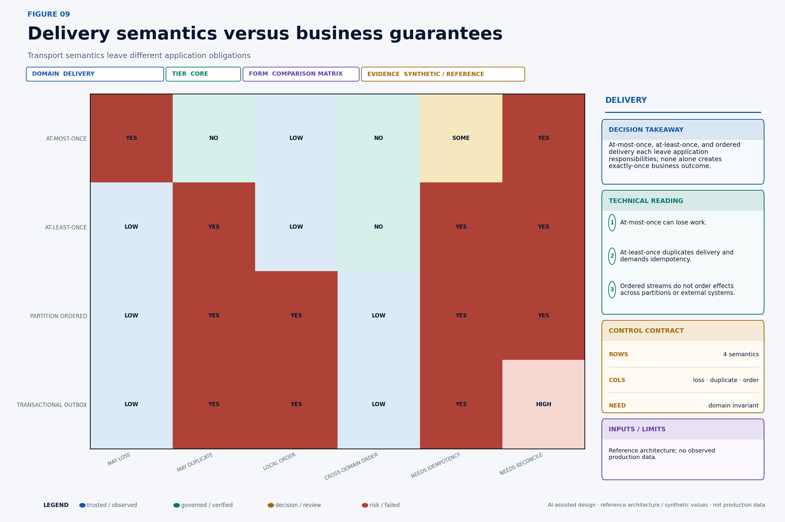

The application must decide its semantic objective per action:

- A diagnostic notification may tolerate at-most-once delivery because missing one low-value event is acceptable.
- A quote reservation generally needs at-least-once attempt with one semantic reservation per action identity.
- A ledger entry needs domain-native idempotency and an authoritative transaction identifier.
- A customer message needs duplicate suppression, but its content also needs a verified-state precondition so a unique message is not uniquely wrong.

HTTP itself distinguishes safe and idempotent method semantics. [RFC 9110](https://www.rfc-editor.org/rfc/rfc9110.html) defines idempotent methods by the intended effect of multiple identical requests, while also noting clients may retry an idempotent request after a communication failure. A POST endpoint does not become semantically idempotent because a client sets a retry header. The resource service must bind a stable key to the same normalized intent and return the prior result on duplicate attempts.

Timeouts are epistemic events. They say the caller did not receive a conclusive response within a window. They do not say the server did nothing. The only safe next state is often `AMBIGUOUS`, followed by a status lookup, receipt query, or domain reconciliation. Blind retry is correct only when the effect boundary is idempotent for the stable action identity.

Reconciliation should be a first-class state machine rather than an error-handler loop. First query the remote system by domain effect ID, idempotency key, or immutable business reference. If the effect exists and its digest and postcondition match, record the receipt and advance to verified. If authoritative evidence proves no effect occurred and the command remains valid, move to retryable under a fresh attempt but the same action identity. If the effect exists with a different digest or incompatible resource state, contain downstream work and escalate a conflict. If the remote system cannot answer conclusively, schedule another bounded observation and increase ambiguity age; do not create a new semantic action to make the dashboard green.

The reconciliation budget belongs to the action class. A customer-visible price change may allow minutes, a low-risk enrichment hours, and an accounting close perhaps no unresolved ambiguity at the cutoff. Define the observation interval, maximum attempts, authoritative queries, terminal deadline, and human owner before deployment. This converts uncertainty from an unbounded technical exception into a priced operational obligation.

## Build an idempotency ledger, not a cache

An idempotency cache that expires after a few minutes may improve UX but is weak protection for business workflows that retry hours later or replay after disaster recovery. The ledger must preserve enough information for the domain's duplication horizon and audit obligations.

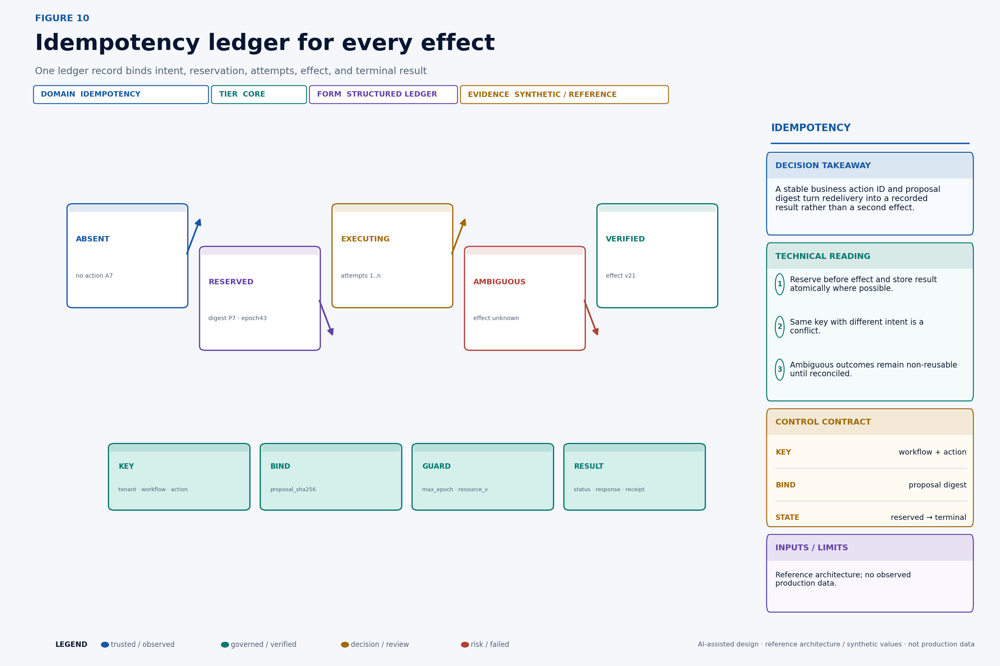

A relational design could begin with:

```sql
CREATE TABLE action_effect_ledger (
  tenant_id           text        NOT NULL,
  domain_scope        text        NOT NULL,
  action_id           text        NOT NULL,
  proposal_sha256     text        NOT NULL,
  workflow_id         text        NOT NULL,
  ownership_epoch     bigint      NOT NULL,
  resource_version_in bigint,
  state               text        NOT NULL,
  attempt_count       integer     NOT NULL DEFAULT 0,
  domain_effect_id    text,
  resource_version_out bigint,
  response_json       jsonb,
  receipt_sha256      text,
  created_at          timestamptz NOT NULL,
  updated_at          timestamptz NOT NULL,
  PRIMARY KEY (tenant_id, domain_scope, action_id)
);
```

On duplicate lookup, compare the stored proposal digest with the incoming digest. Same key and different intent is a conflict, not a replay. Store a normalized result or stable reference so the caller receives the original outcome. If execution begins but the process loses the remote response, keep `AMBIGUOUS`; do not overwrite it with a new attempt's assumption.

Retention should follow the maximum period in which a duplicate could reappear or the effect must be proven, including queue retention, backup restoration, offline clients, reconciliation, and contractual audit windows. Tombstones may be enough after sensitive result data expires, but deleting every trace reopens the key for duplicate execution. Privacy and retention requirements need a designed compromise: minimize stored payload, retain digests and non-sensitive identifiers, encrypt sensitive fields, and separate evidence access from the dedupe key.

## Concurrent agents create lost-update races

The pricing and contract agents are each individually authorized. That does not make their concurrent writes jointly valid. Both can read account version 20, form locally coherent proposals, and race. Without conditional writes, the later request may overwrite the earlier effect or combine fields that were never evaluated together.

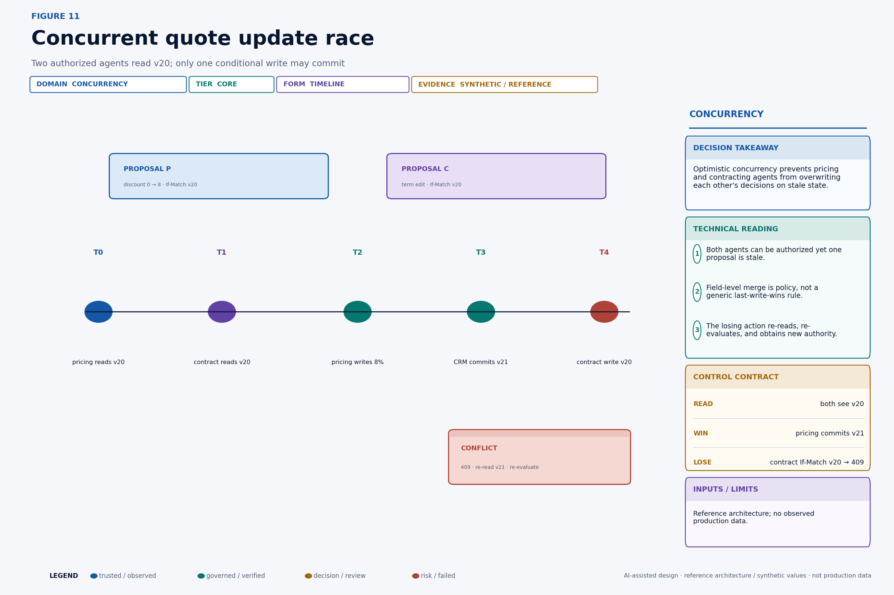

Use optimistic concurrency when conflicts are uncommon and re-evaluation is cheap. The command carries `If-Match: version-20` or a domain equivalent. The first write commits version 21. The second receives a conflict, re-reads version 21, reconstructs evidence, and asks whether its proposal is still valid. It must not simply replace the precondition and retry unchanged.

Use pessimistic serialization when the cost of conflicting work or external side effects is high, the critical section is short, and the domain can enforce a lock safely. Even then, locks need leases, epochs, and failure recovery. A lock held only in agent memory is not a lock.

Field-level merging is valid only when the domain defines independent fields and cross-field constraints. A CRDT can resolve some convergent data types, but a renewal's discount, term, billing schedule, and customer commitment have semantic constraints that a generic last-write-wins merge cannot preserve. Domain policy must decide whether proposals commute, require recomputation, or conflict.

The business implication is important: adding specialist agents increases the number of plausible concurrent proposals. Specialization can improve local reasoning while reducing global consistency unless the platform prices and controls coordination. “More agents” is not free parallelism.

## Cross-domain work is a saga, not a giant transaction

A renewal can reserve a quote, apply price, sign a term, adjust billing, reserve fulfillment, and notify the customer. Those systems rarely share one atomic database transaction. Treat the process as a saga: a durable sequence of local transactions, each with a recovery action or explicit irreversibility.

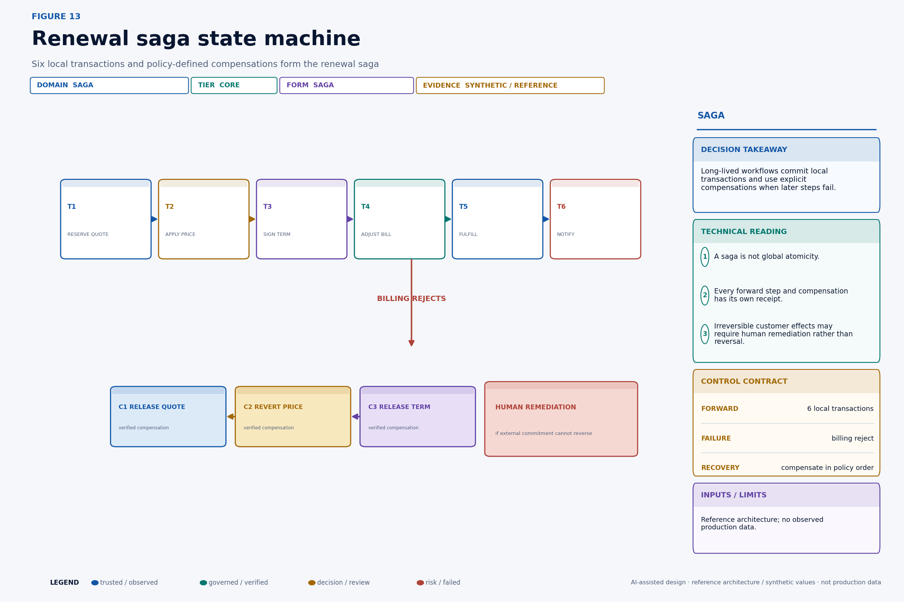

The original [Sagas paper by Garcia-Molina and Salem](https://www.cs.princeton.edu/techreports/1987/070.pdf) describes long-lived transactions as sequences of transactions that can be interleaved, with compensating transactions used when the overall activity must be rolled back. Modern agent platforms inherit the same problem: local commits survive even when later work fails.

Represent the saga explicitly:

```json
{
  "saga_id": "renewal/R9",
  "state": "COMPENSATING",
  "failed_step": "billing.adjust",
  "forward": [
    {"step": "quote.reserve", "receipt": "rcpt_q1", "state": "COMMITTED"},
    {"step": "price.apply", "receipt": "rcpt_p1", "state": "COMMITTED"},
    {"step": "term.sign", "receipt": "rcpt_t1", "state": "COMMITTED"}
  ],
  "recovery_plan_version": "renewal-compensation/8",
  "obligations": [
    {"action": "term.release", "depends_on": [], "state": "READY"},
    {"action": "price.revert", "depends_on": ["billing.cancel"], "state": "WAITING"}
  ]
}
```

Every forward step and compensation has its own stable action identity, authority, precondition, idempotency record, receipt, and verification. The workflow should never mark the saga recovered merely because compensation requests were sent. It verifies postconditions in every affected domain.

Compensation is semantic, not time travel. Releasing a reservation may restore capacity exactly. Reverting a price after an invoice may require a credit note rather than deleting history. A customer message cannot be unsent; recovery may send a correction and create a service task. A signed legal commitment may require counsel and counterparty action. Model the honest terminal states: `RECOVERED`, `RECOVERED_WITH_RESIDUAL`, `ACCEPTED_EXCEPTION`, and `HUMAN_REMEDIATION_REQUIRED`.

## Recovery follows dependencies and customer impact

Blindly running compensations in reverse completion order is unsafe when recovery actions depend on one another or when external commitments have different consequences. Construct a compensation dependency graph when the saga begins or when its plan version is selected.

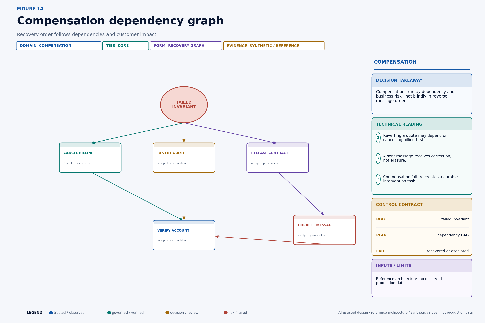

Nodes are compensation or verification actions. Directed edges mean one must complete before another can safely run. The scheduler may parallelize independent nodes, but it must preserve each dependency and domain concurrency guard. Prioritize irreversible or accumulating harm: stop repeated billing before repairing internal metadata; prevent a misleading message before optimizing queue throughput.

A recovery scheduler can rank ready nodes with a transparent function:

```text
priority(c) = w1 × ongoing_loss_rate(c)
            + w2 × customer_visibility(c)
            + w3 × propagation(c)
            + w4 × deadline_pressure(c)
            - w5 × recovery_uncertainty(c)
```

That score determines order among policy-eligible nodes; it does not override mandatory dependencies or approval rules. High uncertainty may route to a human rather than merely lower priority. Record the score inputs and policy version so operators can understand why one recovery ran first.

Compensation failure is itself a durable business event. It should open an intervention task with affected resources, attempted actions, receipts, unresolved invariants, estimated exposure, deadline, and accountable owner. Do not leave failure only in an exception log owned by the platform team.

## Technical deep dive

The following sections retain the quantitative and systems detail for readers implementing the control plane.

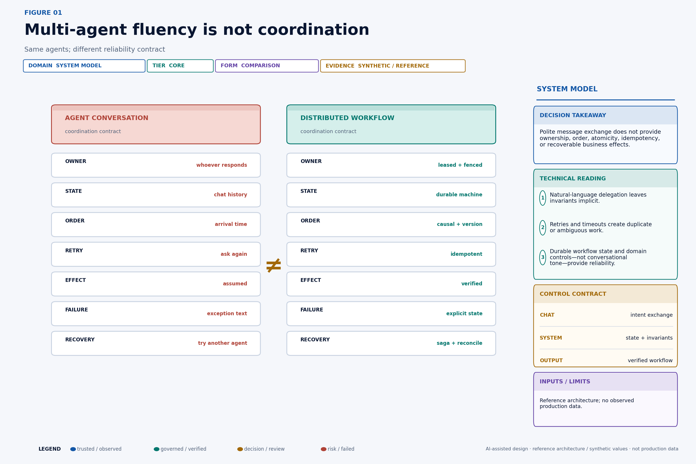

## Chaos tests must assert business invariants

Unit tests that mock successful APIs do not exercise the failure modes that dominate multi-agent coordination. Inject faults at message transport, worker runtime, workflow store, lease renewal, domain response, and compensation execution. Continue the test through recovery.

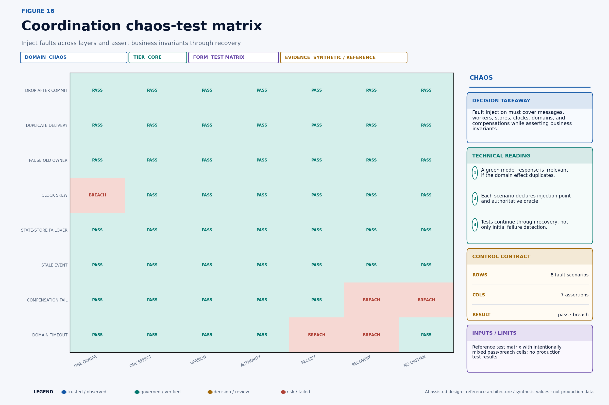

Each test case needs an injection point, timing, affected scope, authoritative oracle, expected transient states, maximum ambiguity age, expected terminal state, and cleanup proof. For example:

```yaml
scenario: pricing_commits_then_response_drops
inject:
  point: pricing-api.after-commit.before-response
  probability: 1.0
command:
  action_id: act_discount_007
expected:
  attempts: ">= 2"
  accepted_effects: 1
  terminal_state: VERIFIED
  resource_version_out: 21
  duplicate_customer_messages: 0
  ambiguity_age: "<= 10m"
oracle:
  - pricing-effect-ledger
  - workflow-receipt-ledger
  - messaging-domain
```

Figure 16 intentionally includes breach cells; it is a reference test-design matrix, not a green certification. A clock-skew scenario breaches one-owner assumptions when expiry depends on unbounded client clocks. A compensation failure breaches recovery and no-orphan assertions if no intervention task is created. A domain timeout breaches receipt and recovery until reconciliation resolves it.

Run deterministic fault cases on every control change and stochastic campaigns against a production-like environment. Vary delay, duplication, reordering, worker pause duration, lease duration, clock skew, dependency failure, and failover timing. Seed synthetic runs and preserve the seed, configuration, event trace, domain snapshots, and oracle results. Test the absence of duplicate effects, not just the presence of expected output.

## Production implementation checklist

- Define workflow, step, action, attempt, effect and receipt identifiers.
- Persist workflow transitions before dispatching external effects.
- Put resource version, authority digest, expiry and ownership epoch on every effect request.
- Enforce fencing and idempotency in each authoritative domain.
- Use a transactional outbox or equivalent durable handoff.
- Reconcile timeout-after-dispatch before retrying.
- Declare compensations, dependencies and human-remediation states.
- Test duplicate delivery, lease expiry, partition, stale write and partial compensation.

## Continue the Production AI Control Plane series

- [Every AI Agent Action Needs a Receipt](https://singhaditya21.github.io/Medium/articles/every-ai-agent-action-needs-a-receipt/)
- [Your AI Agent Needs a Real Kill Switch](https://singhaditya21.github.io/Medium/articles/your-ai-agent-needs-a-real-kill-switch/)
- [Do Not Let an AI Agent Touch Production Until It Passes This Evaluation](https://singhaditya21.github.io/Medium/articles/do-not-let-an-ai-agent-touch-production-until-it-passes-this-evaluation/)

*Part of the Production AI Control Plane series—practical architectures for agent identity, authorization, governance, observability and recovery.*

*Follow Aditya Singh for production-grade enterprise AI architecture, governance and economics.*
