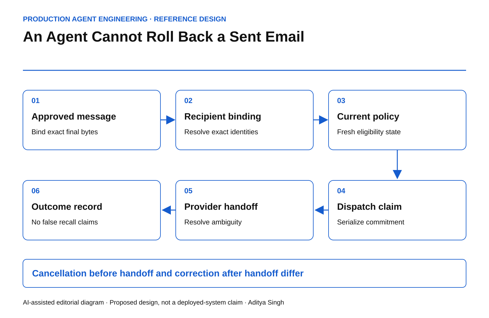

# An Agent Cannot Roll Back a Sent Email

Design a final dispatch boundary for recipient, payload, consent and commercial authority.

This story was developed with AI writing and diagram assistance. The scenario, timing and metrics are illustrative, not measured customer outcomes.

A renewal agent prepares the right message for the right customer. A reviewer approves it. Before dispatch, a contact changes, an attachment is replaced and the customer withdraws from the campaign. The queued task still has a green approval flag.

The final communication boundary must decide whether that exact message is still permitted to leave. Reverting a database record afterward does not remove an email from someone else's inbox.

## Bind the object that was approved

Approval should cover the rendered recipient set, subject, body, attachments, commercial terms and relevant policy state. A template ID alone is insufficient if its variables can resolve differently at send time.

Use protected references for attachments and a defined digest of the final approved bytes. Hashes do not provide confidentiality, and filenames do not establish attachment identity. Preserve evidence without exposing message content in broad operational logs.

*AI-assisted reference architecture. A durable dispatch claim separates cancellable preparation from an external handoff.*

The queue should carry the approved content reference and its expected version. Any material change requires a fresh proposal. Harmless rendering changes still need an explicit definition; do not let a model decide what “material” means without an enforceable rule.

## Distinguish four states

A useful minimum state model is prepared, authorized, dispatching and outcome-known. “Dispatching” matters because the provider may have accepted the message while the caller loses the response.

Cancellation is possible before the defined dispatch commitment. After handoff, the workflow can attempt provider-specific cancellation only where supported, or send a separately approved correction. Neither should be reported as a guaranteed recall.

~~~text
claim_dispatch(message_id):
  atomically verify:
    exact approved payload still selected
    recipient and policy epochs acceptable
    no existing dispatch claim
    deadline and authority valid
  record dispatching with stable external request reference
  hand off through the governed provider adapter
  resolve accepted / rejected / ambiguous
~~~

The database transaction cannot be atomically combined with an arbitrary external email provider. That gap is why ambiguous outcomes and reconciliation remain necessary. The [AWS transactional outbox guidance](https://docs.aws.amazon.com/prescriptive-guidance/latest/cloud-design-patterns/transactional-outbox.html) addresses durable event delivery, while also requiring attention to duplicate processing. It does not guarantee exactly-once recipient delivery.

## Define the race you can actually prevent

A fresh consent check immediately before a network call still leaves a small interval before provider acceptance. State the system's promise: for example, withdrawal accepted before a serialized dispatch claim prevents that claim; withdrawal after the claim cancels only if the provider can still stop the handoff.

That is more precise than claiming instant withdrawal across all in-flight messages. Serialize consent updates and dispatch claims against the same authoritative state when the business requirement needs that ordering.

For an illustrative queue of 5,000 messages, a blanket approval at 09:00 says nothing about the eligibility of message 4,900 at 11:00. Store the approval time, dispatch time and decision evidence separately.

## Resolve uncertain sends before retrying

A timeout must not automatically create a second email. Query a provider's stable message reference where available. Use provider-supported idempotency when documented, but test its retention period and scope.

If the provider cannot establish whether a message was accepted, record ambiguity and use a bounded operator workflow. “No receipt yet” is not evidence of non-delivery.

| Operating metric | Meaning |
|---|---|
| Payload mismatch blocks | Queued content differed from approved content |
| Withdrawal-before-claim blocks | Current policy prevented dispatch |
| Duplicate recipient deliveries | One logical action produced repeated sends |
| Ambiguity age | Time since unresolved provider handoff |
| Correction completion | Approved remediation delivered and recorded |

Do not count a blocked stale message as failed engagement. It is a correctly enforced communication boundary.

## Test with harmless destinations

Use a test mail sink and synthetic addresses. Change a recipient after approval, rotate an attachment, withdraw permission during dispatch and drop the provider response after acceptance. Verify both the stored state and what the sink actually received.

An email can carry a contractual representation or sensitive attachment. The engineering design should reflect that consequence even when the transport looks like a routine API call. Approval is a claim about exact content; dispatch is the moment that claim becomes externally consequential.
