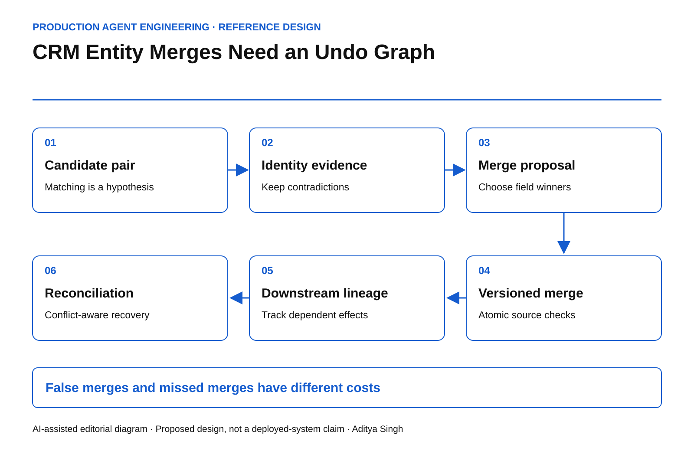

# CRM Entity Merges Need an Undo Graph

Why deduplicating customer records is a lineage operation with a recovery contract.

This story was developed with AI writing and diagram assistance. Examples and numbers are illustrative; no customer records or production results are represented.

Two accounts share a name and an address. An agent merges them. One record belonged to a parent company; the other represented a separately contracted subsidiary. Pipeline ownership, renewal history and an open invoice now appear under the wrong commercial identity.

A high similarity score did not establish that these were the same business entity. More importantly, “undo merge” is no longer one database operation after downstream systems consume the new identifier.

## Separate matching from consolidation

Matching generates a hypothesis: records A and B represent the same entity for a declared purpose. Consolidation chooses a survivor and rewrites references. Keep those as separate permissions.

Define the entity type before evaluating similarity. A legal entity, billing account, household and sales territory are different concepts. Two records can be equivalent for one analytical report and still be unsafe to merge operationally.

*AI-assisted reference diagram. The merge plan preserves the lineage needed to explain and, where feasible, compensate downstream changes.*

The proposal should show identity evidence, contradictory evidence, affected objects, proposed field winners and the systems that will receive the change. A missing identifier is not positive matching evidence.

## Price the asymmetry

Let p be the calibrated probability that a candidate pair represents the same entity. Let C_false be the cost of a false merge and C_missed the cost of leaving a true duplicate unresolved. Ignoring review costs and other options, merging has lower expected loss when:

~~~text
(1 - p) × C_false < p × C_missed
p > C_false / (C_false + C_missed)
~~~

For illustrative costs of $50,000 and $200, that threshold is approximately 99.602%. It is not a recommended universal confidence cutoff. The model assumes calibrated probabilities and simplified losses; a similarity score is not automatically p.

Manual review creates another option with its own cost, delay and error rate. Sensitive account classes may require review regardless of the numerical threshold.

## Commit an explicit merge plan

Use immutable source identifiers, a merge action ID, expected source versions and a pre-merge snapshot protected by the normal data-access rules. Preserve aliases so downstream references can resolve deliberately rather than silently attaching to the wrong customer.

~~~text
merge_plan:
  action_id: merge-demo-42
  sources: [account-A@v12, account-B@v8]
  survivor: account-A
  field_resolution: approved-explicit-map
  reparenting: approved-object-reference-list
  downstream_consumers: [billing, support, analytics]
  recovery_owner: assigned-human-role
~~~

This is a planning contract, not a platform API. A real implementation must also handle record locks, tenancy, permissions and fields that are prohibited from consolidation.

Foreign-key constraints can preserve structural referential integrity, but they do not prove that the selected survivor is commercially correct. See [PostgreSQL's constraint documentation](https://www.postgresql.org/docs/current/ddl-constraints.html). Business equivalence remains an application decision.

## The recovery graph grows after commit

Suppose billing creates a new invoice after the merge, support reassigns two cases and analytics updates a forecast. Recreating the original two rows does not reverse these consequences.

Record a dependency graph from the merge to each downstream effect. Classify edges as automatically compensatable, human-reconcilable or irreversible. A sent customer message belongs in the last category even if the CRM row can be restored.

The recovery operator should see affected objects and a proposed compensation order. Concurrent legitimate edits must not be overwritten with an old snapshot. Compare current versions and route conflicts to the responsible owner.

## Test the graph before trusting the score

| Scenario | Required behavior |
|---|---|
| Parent and subsidiary share an address | Preserve legal-entity distinction |
| One source changes during review | Invalidate or recompute merge plan |
| Consumer receives the event twice | No repeated reparenting effect |
| Billing is unavailable | Visible pending downstream state |
| Unmerge occurs after new invoice | Explicit reconciliation, not blind restoration |

Track precision on reviewed merge samples, unresolved identity conflicts, downstream reconciliation age and the proportion of merges with complete lineage. Do not optimize duplicate-count reduction without checking false merges.

The [transactional outbox pattern](https://docs.aws.amazon.com/prescriptive-guidance/latest/cloud-design-patterns/transactional-outbox.html) can help coordinate a database change with notification of consumers. Consumers still need duplicate handling; an outbox does not make a multi-system merge automatically reversible.

Start with propose-only matching on one low-risk entity class. Expand authority only after the team has demonstrated recovery on intentionally wrong synthetic merges. The meaningful readiness test is whether a false merge remains explainable and containable after downstream systems have acted.
