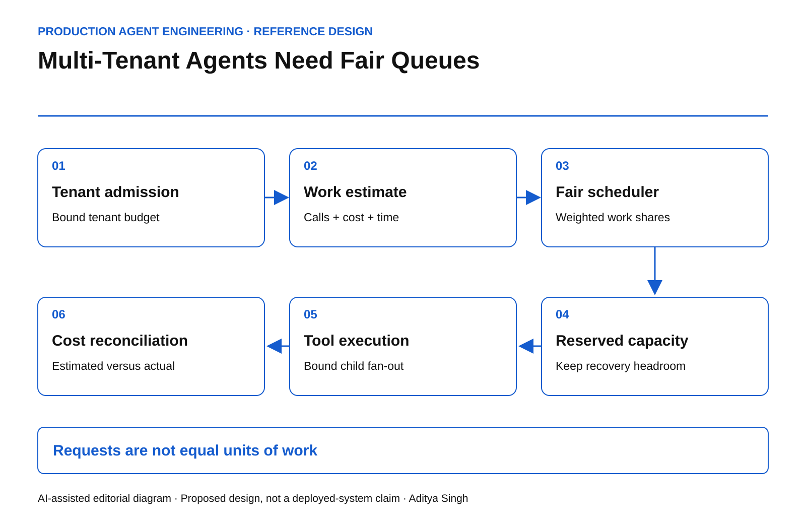

# Multi-Tenant Agents Need Fair Queues

Contain noisy neighbors with work-weighted admission, bounded retries and tenant-level deadlines.

This story was developed with AI writing and diagram assistance. All workload sizes, limits and calculations are illustrative.

One tenant submits ten requests. Another submits one hundred. The first tenant consumes most of the platform because each request launches twenty tool calls, two model evaluations and a repair loop. A request-per-second limit reports fairness while the expensive tenant occupies every worker.

Agent platforms need to govern admitted work, not just incoming messages.

## Identify the scarce resource

The constrained resource may be model concurrency, database reads, a third-party API, human-review capacity or a dollar budget. A single global queue hides which dependency is saturated.

Define a work estimate per action class. Estimates can combine measured service time, reserved tool calls and expected token cost, but keep independent hard caps where resources are not interchangeable. Ten dollars of remaining model budget cannot purchase an extra payment-provider concurrency slot.

*AI-assisted reference architecture. Each admitted workflow reserves capacity before it expands into downstream work.*

The [Google SRE chapter on handling overload](https://sre.google/sre-book/handling-overload/) discusses load shedding and admission under capacity pressure. The agent-specific extension here is to account for work that expands after admission.

## Reserve first, reconcile later

An action should enter with a bounded envelope: maximum concurrent children, maximum tool attempts, deadline and cost reservation. Child agents inherit a share of the parent's budget. Creating another agent must not create another independent allowance.

In an illustrative capacity model, the platform has 120 work units per second. Reserve 20 for recovery and essential control operations, leaving 100 for normal workloads. A noisy tenant limited to 25 units per second cannot consume the recovery reserve merely by opening more sessions.

Unused reservations should expire or be returned when the outcome becomes terminal. An unresolved external action may retain a business-risk reservation even after its compute reservation is released. These are different ledgers.

~~~text
admit(task) only if:
  task.deadline_has_useful_slack
  AND tenant.work_inflight + estimate <= tenant.work_limit
  AND dependency.capacity_can_be_reserved
  AND parent.remaining_budget >= estimate
  AND platform.recovery_reserve_is_preserved
~~~

Implement the reservation updates atomically. The sketch does not supply a distributed lock protocol or settlement implementation.

## Choose a fairness objective

Equal request counts, equal compute time and weighted contractual shares produce different schedules. Write down the objective before selecting an algorithm.

A weighted fair queue can approximate resource shares over a window while allowing unused capacity to be borrowed. Borrowing must be revocable. Otherwise a low-priority workflow can occupy long-running slots after a high-priority tenant becomes active.

Cost estimates will be imperfect. Record estimated and actual work, then update future estimates by action class. Do not punish an entire tenant because one task type changed. Also cap the maximum work of an individual task so a misestimate cannot exhaust the fleet.

## Stop retries from manufacturing priority

A rejected task should retain its original identity, parent budget and deadline. If every retry returns as a new high-priority request, the scheduler rewards failure.

Use bounded backoff and a retry budget. Make retry admission dependency-aware: a recovery probe may be useful when the provider recovers, but hundreds of identical probes are not.

| Failure injection | Evidence expected |
|---|---|
| Tenant opens 1,000 parallel sessions | Shared tenant cap still holds |
| Worker fans out beyond its envelope | Excess children rejected |
| Dependency slows tenfold | Queue bounded; expired work discarded safely |
| Scheduler restarts | Reservations recovered or reconciled |
| Recovery service needs capacity | Reserved control capacity remains available |

Discarding an expired task is safe only if it has not already produced an unresolved external effect. That state belongs in the outcome resolver, not in a generic queue timeout handler.

## Build the operating scorecard

Track p95 and p99 queue age per tenant and action class, admitted work share, useful completions before deadline, estimate error and retry amplification. Aggregate latency can improve while a small tenant becomes permanently starved.

Define useful throughput as verified outcomes completed within their valid decision window divided by elapsed time. A workflow completed after its quote or approval expires is not a timely success.

Run a replay in which one tenant's tasks become ten times more expensive while its request rate stays unchanged. If neighboring tenants breach their objectives before admission reacts, the platform's fairness unit is wrong.

The design goal is precise: one tenant's exploratory agent should not consume another tenant's ability to complete a bounded business action, nor the platform's ability to recover safely.
