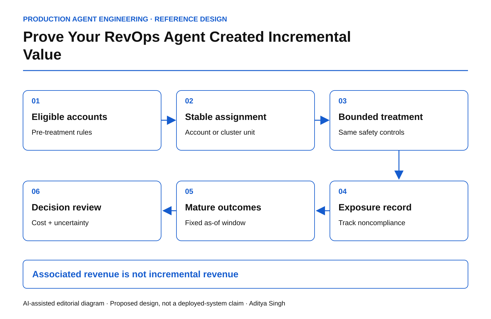

# Prove Your RevOps Agent Created Incremental Value

Design account-level holdouts that separate useful intervention from selection bias.

This story was developed with AI writing and diagram assistance. The experiment, monetary values and sample sizes are synthetic worked examples, not business results.

An agent touches the healthiest renewal accounts first. Those accounts renew at a higher rate. A dashboard credits the agent with every dollar of retained revenue.

The intervention may have helped, but the comparison cannot establish that. Account selection, sales-team attention and existing customer health can produce the same pattern. A decision ledger needs an experimental design before it becomes evidence of value.

## Define the intervention and the unit

Write down exactly what changes: perhaps the agent prepares an evidence-backed renewal brief and suggests a next action, while commercial decisions remain human-approved. “AI enabled” is too broad to be a treatment definition.

Randomize at the account level when people and opportunities within an account can influence each other. Related subsidiaries, shared account teams or overlapping campaigns may require a larger cluster. The correct unit follows likely spillovers, not whichever identifier is easiest to hash.

*AI-assisted reference diagram. Assignment is recorded before exposure; outcomes are evaluated after a fixed maturity window.*

Microsoft's [pre-experiment guidance](https://www.microsoft.com/en-us/research/group/experimentation-platform-exp/articles/patterns-of-trustworthy-experimentation-pre-experiment-stage) is useful for disciplined design. The RevOps scenario here is an original application, not a reported Microsoft experiment.

## Keep allocation stable and auditable

Record eligibility and assignment before the first intervention. Stratify on important pre-treatment features such as account size, renewal month and baseline risk when appropriate. Keep a versioned allocation rule; rerunning the job must not move inconvenient accounts between groups.

~~~text
experiment_record:
  account_id: synthetic-account-42
  eligibility_version: renewal-cohort-v3
  assigned_arm: treatment
  assigned_before_first_exposure: true
  intervention_version: brief-assistant-v2
  outcome_window_days: 90
  safety_policy: unchanged-human-commercial-approval
~~~

The 90-day window is illustrative. Choose a period consistent with the actual sales cycle and fix the analysis rule before observing outcomes.

Exclude legally or operationally ineligible cases before randomization. Do not weaken approval, privacy or contractual protections to create a larger treatment effect.

## Count everyone assigned

Intention-to-treat analysis compares accounts by original assignment, including treatment accounts whose staff never used the agent. That estimates the effect of offering the intervention under the tested adoption conditions.

An analysis restricted to enthusiastic users answers a different, selection-prone question. Track adoption separately. If noncompliance is substantial, involve an experimentation specialist before interpreting per-protocol or instrumental-variable estimates.

For an illustrative trial with 200 accounts per arm, suppose average 90-day contribution margin is $12,400 in treatment and $12,000 in control. The observed difference is $400 per assigned account, or 3.33% relative to control.

If treatment adds $70 per account in model, tool, review and correction cost, the estimated net difference is $330 per assigned account. This is arithmetic, not proof of a reliable positive effect. A confidence interval needs the outcome variance and valid assumptions about clustering.

~~~text
estimated_net_increment =
    mean_margin_treatment - mean_margin_control
    - incremental_operating_cost_per_assigned_account
~~~

Do not substitute booked revenue for contribution margin while leaving discounts and remediation out of cost.

## Protect the comparison from contamination

Salespeople may apply an agent's recommendations to control accounts. Shared playbooks can spread the treatment. Record meaningful crossovers and consider team-level randomization if spillover is unavoidable.

Also inspect sample-ratio mismatch, missing outcomes and delayed labels. A control account with an unresolved renewal is not automatically a lost renewal. Freeze an as-of dataset and define censoring rules.

Repeatedly checking an ordinary significance test and stopping as soon as it looks positive inflates false-positive risk. Use a pre-specified fixed horizon or a valid sequential method.

## Make safety a separate release gate

| Dimension | Decision evidence |
|---|---|
| Incremental value | Difference with uncertainty, cost and outcome maturity |
| Adoption | Eligible staff actually exposed and using the intervention |
| Commercial safety | Unauthorized discounts or commitments |
| Customer burden | Complaints and unwanted contact |
| Operational cost | Review, correction, delay and unresolved work |

A positive average cannot authorize a treatment that breaches a critical commercial or privacy constraint. Likewise, no significant effect in a small trial does not establish that the effect is exactly zero.

The [Microsoft post-experiment guidance](https://www.microsoft.com/en-us/research/articles/patterns-of-trustworthy-experimentation-post-experiment-stage/) emphasizes trustworthy interpretation rather than a single attractive metric. Preserve negative and inconclusive findings in the same ledger as positive ones.

Before expansion, ask a harder question than “how much revenue did the agent touch?” Ask what changed because eligible accounts were offered this intervention, under the actual cost, safety and adoption conditions being tested.
