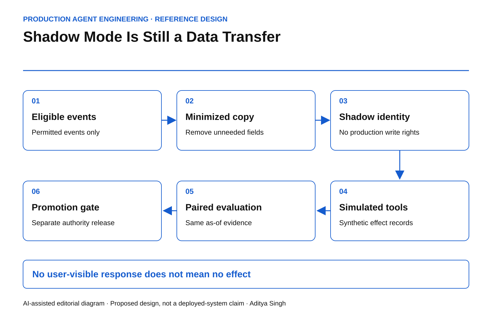

# Shadow Mode Is Still a Data Transfer

How to evaluate an agent without silently copying production authority, data or side effects.

This story was developed with AI writing and diagram assistance. Scenarios, calculations and test targets are illustrative. This is an engineering reference design, not a claim about a deployed customer system.

A team puts a renewal agent into shadow mode. Its recommendations never reach a customer. That sounds safe until the agent retrieves a live contract, sends it to a second model provider and invokes a tool that creates a task in production CRM.

Suppressing the final answer did not suppress the workflow's effects. Shadow mode needs a data-and-authority boundary, not just a hidden output channel.

## Separate traffic mirroring from safe evaluation

Envoy's request-mirroring mechanism can copy traffic to another cluster without waiting for its response. The [official request-mirroring documentation](https://www.envoyproxy.io/docs/envoy/latest/api-v3/config/route/v3/route_components.proto#envoy-v3-api-msg-config-route-v3-routeaction-requestmirrorpolicy) describes transport behavior. It does not certify that the receiving workload is harmless.

For agents, the secondary workload can perform its own retrieval, tool calls and logging. Those downstream paths need independent controls.

*AI-assisted reference diagram. The shadow identity reaches simulated tools, not the production effect gateway.*

Start with an eligibility service that chooses permitted events. Remove secrets and unnecessary personal fields before copying. Use a separate shadow identity and separate destinations for traces, memory and outputs. Deny production writes at network and service boundaries even if the prompt says “do not act.”

## Give tools a deliberately different contract

A shadow tool should produce a typed simulated result and a proposed-effect record. It must not call a live mutation endpoint and then discard the response. Also inspect nominal reads: fetching a URL, opening a tracked document or resolving a customer resource may itself create an external request or audit event.

~~~python
def select_executor(mode, effect_class):
    # Reference policy sketch: real adapters require authenticated,
    # server-derived mode and independent gateway enforcement.
    if mode == "shadow":
        if effect_class in {"mutation", "external_message", "unknown"}:
            return "simulator"
        return "approved_shadow_read_adapter"
    return "normal_policy_gated_adapter"
~~~

The mode cannot be supplied by the model as an untrusted string. The authenticated execution environment sets it. A live tool gateway should reject shadow principals even if an adapter is misconfigured.

## Budget load as well as data

In an illustrative workload, production receives 100 requests per second. Mirroring 10% adds 10 shadow requests per second. If each performs five retrievals, the shadow lane adds 50 retrieval calls per second before retries.

That is enough to affect a dependency that had only 30 calls per second of spare capacity. Shadow traffic can therefore damage the production system without producing a single customer-facing recommendation.

Reserve a separate concurrency pool and a hard request budget. Drop shadow work first under pressure. Define what happens to partially executed evaluation runs: record them as incomplete rather than treating dropped tasks as successful low-latency results.

## Make the comparison scientifically interpretable

Each paired record should contain the production input version, shadow configuration digest, permitted evidence snapshot and evaluation timestamp. Separate disagreements caused by model behavior from disagreements caused by different data arriving later.

Do not feed future outcomes back into the shadow context and then compare it to a production decision that could not have known them. A supposedly better agent may simply have access to tomorrow's answer.

Use paired outcome categories: equivalent, materially better under the declared rubric, materially worse and inconclusive. Preserve the reason for inconclusive outcomes. Excluding them silently biases the comparison toward easy cases.

| Dimension | Measure | Failure condition |
|---|---|---|
| Effect isolation | Accepted production mutations by shadow identity | Any accepted mutation |
| Data minimization | Fields copied outside the approved event schema | Any unauthorized field |
| Load isolation | Production latency under shadow load | Declared budget breached |
| Evaluation integrity | Paired runs with matching as-of evidence | Unexplained mismatch |

These are proposed acceptance conditions, not universal benchmarks.

## Rehearse the failures before turning on traffic

Point one simulator deliberately at a production endpoint in an isolated test. The downstream service should reject the identity. Rotate a shadow credential and confirm old work cannot continue retrieving data. Kill the evaluation collector and confirm production continues independently.

Promotion remains a separate decision. Shadow agreement does not establish safe behavior after authority is granted. A system that could only propose changes in testing encounters new failure modes once it can commit them. The [Google SRE canarying chapter](https://sre.google/workbook/canarying-releases/) provides useful deployment discipline; an agent release additionally needs a declared effect envelope.

A useful final question is: if every “shadow” flag were accidentally ignored by application code, which independent controls would still prevent production consequences?
