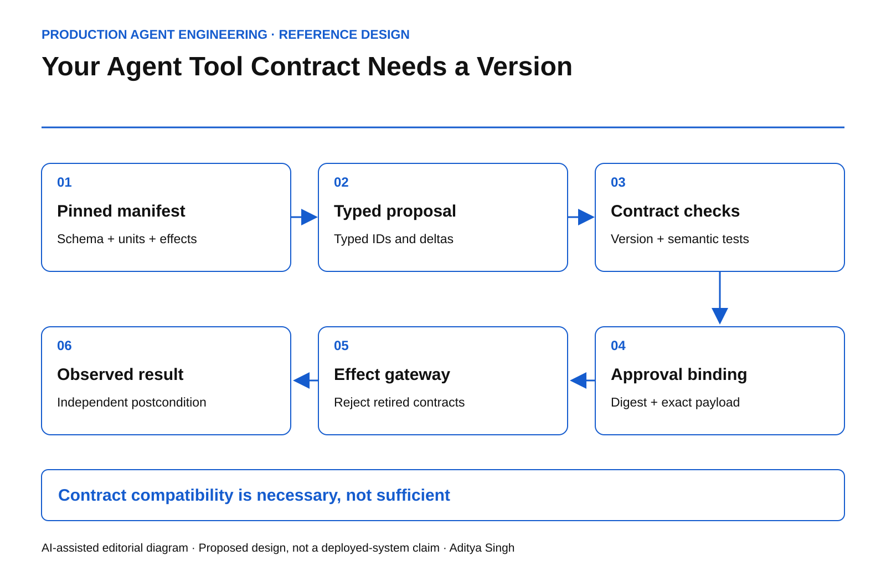

# Your Agent Tool Contract Needs a Version

A deployment contract for schema drift, semantic changes and stale approvals.

This story was developed with AI writing and diagram assistance. All scenarios, numerical examples and operating targets are illustrative reference designs, not reported production results.

A CRM agent is approved to apply a discount of 8. The tool still accepts a number. Yesterday that field meant a percentage; today it means a currency amount. A JSON validator can accept both requests while the business meaning changes underneath the approval.

The failure is a versioned-contract problem. A tool name, a description and a syntactically valid argument object are not enough to define an executable commercial action. The permission must cover one interpretation of those arguments.

## Define the artifact the agent actually consumes

A release manifest should bind the input schema, response schema, units, effect classification, resource-version behavior, error semantics and authorization requirements. Include the executable adapter digest and the external API version. The schema author and adapter maintainer may be different teams; both need a promotion gate.

JSON Schema provides ways to require fields and constrain additional properties. These are useful structural controls, but they cannot establish that a field's unit or operational meaning stayed constant. That distinction comes from the [JSON Schema object reference](https://json-schema.org/understanding-json-schema/reference/object); the release contract proposed here adds domain semantics.

*AI-assisted reference diagram. The manifest and approved operation meet again at the effect gateway.*

~~~json
{
  "tool": "quote.apply_discount",
  "contract_version": "3.1",
  "amount": {"unit": "basis_points", "maximum": 800},
  "effect": "conditional_write",
  "requires": ["quote_version", "action_id", "approval_digest"],
  "response": ["outcome", "resource_version", "effect_reference"]
}
~~~

The example is an interface sketch, not a complete authorization token. Authentication, signatures, tenancy and policy evaluation belong in the implementation.

## Pin meaning through the complete action

The planner reads a manifest digest. The proposal records it. Approval binds that digest together with tenant, resource, intended delta and expected resource version. At execution, the gateway must recognize the same supported artifact.

A schema-compatible addition can still be operationally unsafe. Adding a default notification flag may turn an internal update into an external communication. A new retry policy can duplicate effects. An adapter that starts returning cached reads can weaken verification without changing any JSON field.

Therefore maintain two compatibility classifications: structural compatibility and effect compatibility. Either can block promotion.

~~~text
permit_execution =
    authenticated_principal
    AND approved_manifest == installed_manifest
    AND request_conforms_to_schema
    AND approved_delta == requested_delta
    AND current_resource_version == expected_version
    AND current_authority_allows_action
~~~

Equality of digests proves equality of artifacts only under a defined canonicalization and trustworthy artifact registry. It does not prove the artifact is correct. Test that separately.

## Review the combinations, not just the newest release

Consider three supported consumers, two adapter versions and four operation classes. That creates 24 compatibility cells before adding tenant policy or failure conditions. This is a test inventory, not a claim that all cells require identical tests.

For each cell, check a valid request, a removed field, an unknown enum, a changed unit and a response that claims success without a resource reference. Critical cells also need replay and stale-resource tests.

| Change | Default disposition | Evidence needed |
|---|---|---|
| Optional observational response field | Candidate for compatible release | Old consumer ignores it safely |
| New external email side effect | Breaking effect change | New approval and communication policy |
| Percentage changed to basis points | Breaking semantic change | Explicit migration, no silent conversion |
| Adapter timeout behavior changed | Risk review | Duplicate-effect and ambiguity tests |

## Roll out without stranding pending work

Keep old manifests available for explanation, but do not assume old authority should remain executable. Define an acceptance deadline and a migration rule for pending proposals. If a material contract changes after approval, invalidate the approval and create a new proposal.

Use a canary whose cohort includes the highest-risk affected operation, not merely a random slice of low-risk reads. Record the first and last resource versions handled by each adapter. During rollback, prevent a downgraded adapter from interpreting new-format actions.

HTTP conditional requests offer a standard mechanism for resource preconditions; see [RFC 9110, section 13](https://www.rfc-editor.org/rfc/rfc9110.html#section-13). A resource precondition complements the manifest check; neither substitutes for the other.

## Operate the boundary

Measure unsupported-manifest rejection, semantic-drift test coverage, approval invalidations after release and the age of pending actions pinned to retired versions. A rising rejection rate may be a correct safety response to a broken rollout, not a reason to disable the gate.

Before production, deliberately change a unit while keeping its primitive type unchanged. Then change a response field without changing the effect. The system should reject the first and correctly classify the second.

The architecture review question is specific: can the team reconstruct precisely what one approved tool call meant, even after the adapter and API have both changed?
