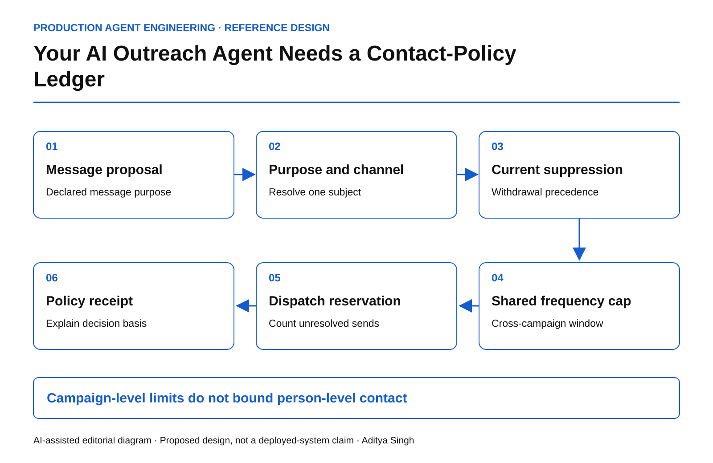

# Your AI Outreach Agent Needs a Contact-Policy Ledger

Enforce purpose, channel, suppression and frequency across every campaign and agent.

This story was developed with AI writing and diagram assistance. Examples and limits are illustrative engineering policies. This article does not provide legal advice or claim that one consent model applies in every jurisdiction.

Three teams each obey their own weekly email cap. A customer still receives six messages because the teams have different campaign systems and each AI agent sees a different customer identifier.

The missing object is a shared contact-policy ledger: the current decision about whether a specific person may be contacted for a specific purpose, through a specific channel, under a defined organizational policy.

## Do not reduce eligibility to one Boolean

A field called “consent = true” erases context. Capture the subject identity, channel, purpose, policy basis determined by the organization, evidence reference, effective time and withdrawal or suppression state. Support unknown and conflicting states explicitly.

A service notification and a promotional message may follow different policies. The agent must not relabel a sales pitch as a service message to pass a gate. Classification should be constrained by approved templates, workflow context and review where required.

*AI-assisted reference architecture. Shared policy and frequency state are checked before a dispatch reservation.*

Legal and privacy owners determine the applicable rules. Engineering translates those decisions into a versioned contract and observable enforcement. Do not ask a language model to infer legal permission from a scraped email address or a social-media reaction.

## Use one subject across systems

Resolve CRM contact IDs, mailing-list IDs and campaign identifiers through a governed identity map. Preserve uncertainty: if two possible identities carry different suppression states, do not pick the permissive one because it enables the send.

Store source provenance and conflict resolution. A newer imported marketing list should not silently erase a direct suppression instruction. The policy team should define precedence and the supported reconciliation process.

The registry itself contains personal data. Restrict access, minimize retention and keep detailed contact evidence out of shared debugging dashboards.

## Frequency requires atomic reservations

An illustrative organizational policy allows at most two non-essential messages per person in a rolling seven-day window. Three agents checking “one message sent so far” can all decide to send unless the check and reservation are serialized.

~~~text
eligible =
  identity_resolved
  AND channel_and_purpose_allowed
  AND no_applicable_suppression
  AND policy_evidence_current

reserve only if:
  eligible
  AND sent_in_window + unresolved_reservations < limit
~~~

Use a rolling window defined precisely at boundary times. Release a reservation only when the action is cancelled or proven not to have been sent. An ambiguous provider outcome should not free another slot automatically.

The two-message example is a design illustration, not an engagement recommendation, legal threshold or provider policy.

## Treat unsubscribe as an input with operational priority

[RFC 8058](https://www.rfc-editor.org/rfc/rfc8058.html) specifies a one-click unsubscribe mechanism for email. Supporting that mechanism does not by itself establish an organization's complete permission policy.

When a suppression arrives, update authoritative state and invalidate applicable queued proposals. Measure propagation to every sending path, including manual campaign tools and agents. The remaining gap is operational if an agent honors the ledger but another system bypasses it.

Define the dispatch race explicitly: a suppression serialized before dispatch reservation blocks that reservation; messages already accepted by a provider may need a different remediation path. Promise only what the infrastructure can enforce.

## Measure restraint as well as reach

| Measure | Why it matters |
|---|---|
| Suppression propagation p99 | Slow paths keep outdated contact authority |
| Cross-campaign cap breaches | Isolated campaign limits miss cumulative contact |
| Unknown identity holds | Uncertainty is preserved instead of guessed away |
| Purpose mismatch blocks | Content is not silently reclassified to permit contact |
| Unresolved dispatch reservations | Ambiguous sends do not create extra capacity |

The primary quality outcome is appropriate, wanted communication, not the number of addresses an agent can reach. Response rate alone can reward aggressive contact while concealing complaints and suppression failures.

## Test a conflict, not just a happy path

Create one synthetic person with three campaign IDs. Allow two purposes, suppress one channel and queue concurrent proposals. Then introduce a conflicting imported record. The system should produce one explainable policy decision per proposed contact and preserve the restrictive state required by the declared policy.

Finally, test a withdrawal against a long queue and verify the actual test-mail sink. A checked box in CRM is insufficient evidence that every dispatcher obeyed it.

The operating question is simple: can every team and agent explain why this person received this message now, using the same current policy state?
