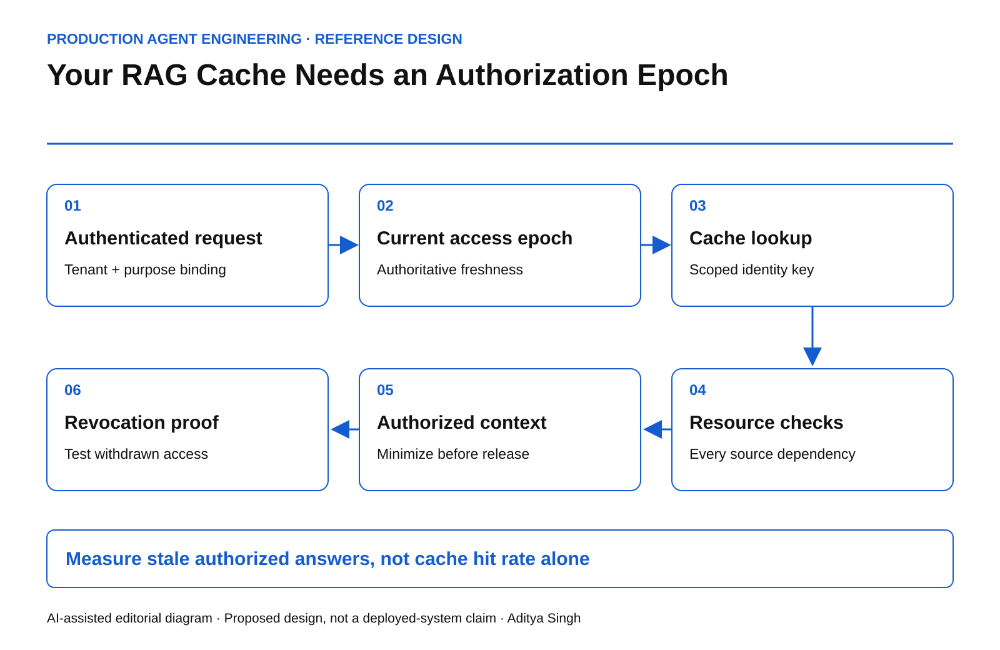

# Your RAG Cache Needs an Authorization Epoch

Fast retrieval is unsafe when permission changes cannot invalidate the answer.

This story was developed with AI writing and diagram assistance. All timelines and numerical examples are illustrative reference scenarios.

At 09:00 an employee may read an acquisition document. At 09:05 that access is removed. At 09:06 the employee asks a slightly different question and receives the same sensitive facts from a cached agent answer.

The source authorization changed. The derivative answer did not. A cache keyed only by prompt similarity has created a second access-control system, usually without anyone assigning it that responsibility.

## Cache the decision boundary explicitly

The cache entry should identify the tenant, permitted purpose, source versions, policy version and the authorization state against which it was constructed. Depending on the domain, the entry may belong to one principal or to a precisely defined equivalent-access cohort. Do not infer equivalence from a shared job title.

An authorization epoch is one implementation technique: a monotonically changing value that invalidates prior access assumptions. It can be tenant-wide, resource-specific or scoped to a permission graph. A coarse epoch is simple but can destroy hit rate. A fine-grained epoch preserves reuse but requires correct dependency tracking.

*AI-assisted reference diagram. Cached content is admitted only against current authorization evidence.*

Google's [Zanzibar paper](https://research.google/pubs/zanzibar-googles-consistent-global-authorization-system/) is relevant because authorization correctness can depend on consistency and ordering, not merely an access predicate. This article's cache design is an application-level proposal, not a claim that Zanzibar implements it.

## Freshness needs a trustworthy source

A cached epoch cannot independently prove that it is current. If both the answer and its permission state come from the same stale replica, the apparent check adds no protection.

For high-risk content, require an authorization result at least as recent as the relevant revocation or resource update. If that cannot be established during a partition, omit the protected evidence or refuse the answer. Lower-risk content may use a deliberately bounded staleness policy, but the allowed window must be explicit.

~~~text
serve_cached_answer =
    tenant_matches
    AND purpose_matches
    AND all_source_versions_acceptable
    AND current_authorization_allows_all_sources
    AND entry_access_epoch >= required_access_epoch
    AND retention_and_deletion_conditions_hold
~~~

This is a specification, not executable security code. Implementations must bind the request identity at the gateway and define what “current” means for each authority source.

## Know what the answer depends on

An answer may combine three documents, a summary and a tool result. Store dependency references sufficient to invalidate or reauthorize those inputs. Text similarity cannot recover that lineage reliably after the fact.

For an illustrative answer depending on 12 resources, checking only the highest-ranked document leaves 11 dependencies outside the authorization check. If one contains the decisive sensitive fact, filtering the first result has accomplished little.

Avoid solving this with raw evidence copies in the cache metadata. Use protected references, scoped identifiers and keyed digests where appropriate. A content hash is not encryption and may itself leak low-entropy information.

## Test permission transitions, not only steady state

| Transition | Expected result |
|---|---|
| User loses group membership | Old answer cannot bypass the change |
| Document moves into a restricted collection | Recheck inherited permissions |
| Same query arrives from another tenant | No cross-tenant cache reuse |
| Source is deleted under policy | Derivative answer quarantined or removed |
| Authorization dependency is unreachable | Declared safe fallback, not silent reuse |

Include concurrent cases: retrieval begins before revocation and generation finishes afterward. Define the authorization moment the system promises. For especially sensitive responses, check again before release. Continuous byte-by-byte guarantees require a different design from request-start authorization; do not imply one when only the other exists.

PostgreSQL's [row-security documentation](https://www.postgresql.org/docs/current/ddl-rowsecurity.html) also warns about races when policy decisions consult other changing rows. It illustrates why evaluating an access expression is not automatically equivalent to enforcing a consistent authorization history.

## Measure the risk introduced by reuse

Track stale-authorized-answer incidents, revocation propagation lag, reauthorization failures and cache invalidations by cause. Retain cache hit rate and latency, but treat them as efficiency measures.

If 10,000 eligible requests generate 7,000 cache hits, the hit rate is 70%. If 20 of those hits are served under obsolete authorization, the conditional stale-authorization rate is 20/7,000, approximately 0.286%. The hit-rate success does not cancel the security failure. Both numbers are synthetic.

Revocation tests should use identifiable synthetic facts so the team can see whether protected content survived in summaries or final answers. Avoid using real secrets as test probes.

The deployment question is not whether the cache is fast. It is whether a revoked reader can still retrieve an answer derived from data they are no longer entitled to receive.
