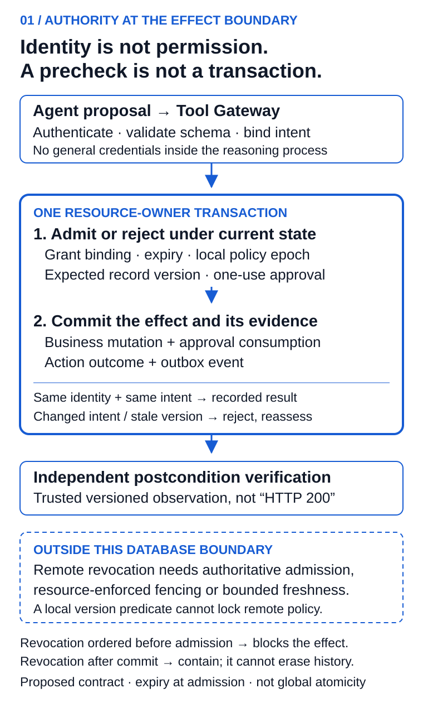

# Every AI Agent Needs a Passport

*A technical architecture for identity, delegated authority and accountable execution*

In an illustrative CRM incident, an agent updates 40 opportunities at 9:02. Five minutes later, Sales Operations finds that three late-stage deals were changed in error. The audit trail identifies only a shared integration account.

The immediate operating questions are specific: which workload acted, whose authority it used, what change was approved, and where the next write can be stopped. A useful agent passport must make those questions answerable at the system that performs the action.

The design below connects a registered identity, an attested workload credential, a time-bounded task grant and an execution receipt. They have different issuers and lifetimes. A single large token cannot replace those responsibilities.

## The decision for the operating owner

Before granting write access, ask the implementation team to demonstrate one control: two workers present the same approval while a record or permission changes. Which transaction is allowed to commit, and where is that decision enforced?

The owner should receive a defined action boundary, a demonstrated failure test and a named recovery operator. An inventory of agents is useful, but it does not supply that evidence.

This architecture applies to workloads accessing protected data or creating external effects. An assistant summarizing public text needs less assurance than a system changing customer entitlements. The three profiles below are organization-defined examples, not industry certification levels.

| Profile | Minimum operating contract |
| --- | --- |
| Observed assistant | Registration, accountable ownership, workload identity and traceability |
| Constrained operator | Task-scoped grants, external enforcement, receipts and tested recovery |
| Privileged actor | Transaction-bound approval, sender-constrained credentials, independent verification, separation of duties and a defined fail-closed revocation contract |

## Separate the principals before designing the token

The requesting principal is the person, service or event initiating work. The logical agent is the durable capability, such as `opportunity-hygiene-agent`. The workload instance is the process running it. The executing model is the model/version used for a reasoning step.

A model can change without changing the logical agent. Two agents can use the same model while holding different permissions. Preserve those distinctions in delegation and receipts instead of collapsing every operation into an integration account.

Identity answers who is calling. Authority determines what that caller may do now. The evidence must remain reconstructable after both the credential and the process have expired.

## Four artifacts with different jobs

| Artifact | Issuer and purpose | Lifecycle |
| --- | --- | --- |
| Passport manifest | Registry: owner, purpose, lineage and capability envelope | Versioned and periodically recertified; suspend or supersede |
| Workload credential | Workload identity system: attested runtime identity | Short-lived; rotation and termination behavior specified |
| Task grant | Authorization service: subject, actor, audience, permitted action and limits | Bounded lifetime; explicit revocation and delegation rules |
| Evidence receipt | Trusted execution/evidence service: requested, approved, attempted and observed outcome | Retained under the organization's access and retention policy |

A manifest is a claim about an approved capability, not permission for every action inside its broad envelope. Each task projects only the authority needed for that action. A receipt is evidence, not retroactive authorization.

The following shortened manifest is a conceptual payload, not a published standard or a signed credential:

```json
{
  "schema_version": "1.2",
  "passport_id": "opportunity-hygiene",
  "version": 7,
  "agent_id": "spiffe://enterprise.example/agents/revops/opportunity-hygiene",
  "owner": {
    "primary": "group:revenue-platform",
    "backup": "group:enterprise-operations",
    "risk_approver": "group:enterprise-risk"
  },
  "business_purpose": "Correct incomplete opportunity records",
  "lifecycle_state": "active",
  "capabilities": [{
    "resource": "crm/opportunity",
    "actions": ["read", "update"],
    "conditions": {
      "regions": ["IN", "SG"],
      "record_limit": 50,
      "prohibited_stages": ["Closed Won", "Closed Lost"]
    }
  }],
  "policy_bundle": {"id": "revops-agent-policy", "version": "1.8.0"},
  "recertification_due": "2026-10-31"
}
```

An implementation also needs verified issuers, signature and algorithm rules, issuance/expiry, deployment evidence and the status/version chain. A mutation approval should bind the tenant, represented principal, actor, target, exact delta, record preconditions, tool version, action identifier and expiry using a specified canonical representation. Avoid signing ambiguous display text.

## Seven layers, with accountable operators

1. **Registry.** Map approved capabilities to business owners, deployments, data classes, tools and lifecycle state. Risk-based recertification follows material changes in capability or deployment assurance; it need not treat every equivalent model patch as a new business purpose.
2. **Workload identity.** Attest the running instance. SPIFFE distinguishes workload identifiers and SVID credentials; an SVID does not itself grant CRM authority. Explicit federation and issuer-bound trust bundles are required across trust domains. [SPIFFE overview](https://spiffe.io/docs/latest/spiffe-about/overview/), [federation specification](https://spiffe.io/docs/latest/spiffe-specs/spiffe_federation/).
3. **Delegation.** Preserve the represented subject and executing actor. RFC 8693 supplies token-exchange subject/actor semantics; application-specific limits still need enforcement. RFC 9396 supplies a container for authorization details, not their business meaning. A pricing-agent handoff should lose CRM write privileges and receive a pricing-specific audience. [RFC 8693](https://www.rfc-editor.org/rfc/rfc8693.html), [RFC 9396](https://www.rfc-editor.org/rfc/rfc9396.html).
4. **Policy decision.** Evaluate the caller, purpose, resource, impact and current approval state. Record the decision identifier and policy version. Permit, deny, require approval and permit-with-obligations are application design choices; the enforcement point must implement the result.
5. **Tool enforcement.** Validate each consequential command outside the model. Restrict schema, destination, values and audience. Workload credentials stay outside the reasoning environment. A prompt cannot enforce a refund limit.
6. **Evidence.** Join subject, actor chain, workload, action/approval hashes, policy version, command result and independent verification. Protect controlled references, detect missing receipts, and define retention, redaction and access. Traces can contain sensitive material; indiscriminate prompt logging creates another risk.
7. **Revocation and degraded operation.** Name the operator who can suspend grants, block tools or quarantine a deployment. Define enforcement freshness and failure behavior. A cached worker must not retain an undocumented path to write after the control interface is disabled.

## A last-second check does not remove the race

Suppose a gateway reads “approval active.” A revocation commits before the CRM write. If the resource-owning service blindly trusts the earlier result, the write can still proceed. Moving the check closer to the write reduces elapsed time; it does not make two independent operations atomic.

For a local transaction domain, the record-version condition, approval consumption, effect identity and business mutation can share an atomic boundary. The authority state used there must follow the same locking or serialization contract. A version predicate protects that record; it does not magically lock an external policy service. PostgreSQL's documentation illustrates why successive reads can see different states and how an update rechecks its row predicate. [PostgreSQL transaction isolation](https://www.postgresql.org/docs/18/transaction-iso.html).



*Figure 1. Proposed enforcement contract. The local commit binds the business effect, approval consumption and outcome record. External revocation needs an explicit freshness or fencing protocol; it is not inside this database transaction.*

The contract must answer two different questions:

- **Admission:** what policy version and grant state must be valid when a new effect is admitted?
- **Ordering:** if revocation races with an admitted action, which one takes precedence and what must the resource owner reject?

In the local example, revocation committed before the serialized admission check blocks the action. Revocation ordered after a committed action cannot undo it. Expiry is checked at admission; a deployment requiring “no commit after expiry” needs a stricter completion-time contract as well. Keep that distinction visible.

For distributed policy, choose and document a supported mechanism: authoritative admission, resource-enforced epochs/fencing with a defined propagation boundary, or explicitly bounded cached authority. High-risk new effects fail closed when the required state cannot be established. Short token lifetime alone is not instantaneous revocation.

## Sender constraint and one-use approval are different controls

DPoP binds a proof to request context and can make a stolen access token less useful without the corresponding key. RFC 9449 describes proof-identifier tracking to reject reuse and notes the shared-state problem across servers. It also does not stop an attacker controlling the legitimate process and key. [RFC 9449 §11](https://www.rfc-editor.org/rfc/rfc9449.html#section-11).

Rejecting the same proof twice does not establish “this business approval can create only one effect.” Two fresh proofs can accompany the same business approval. That second property requires a durable action binding and consumption rule at the mutation boundary. A retry resolving an already-recorded result is different from admitting a new mutation.

## The CRM execution, made testable

Keep the illustrative policy: India and Singapore only, no Closed Won or Closed Lost records, at most 50 records, approval above 20. The manager reviews an exact diff with source evidence and recovery limits. Approval binds the batch intent and each record precondition.

The resource service validates the command and current authority, then checks the expected record version and consumes the matching approval under its transaction contract. An idempotent replay returns a recorded result; a changed delta, tenant, actor or action identity is rejected. A separate verifier compares observed records with the approved diff before the receipt is marked verified.

Batch semantics must be explicit. A single local transaction can make a supported batch atomic. A multi-service workflow may commit a subset; its receipt must list committed, rejected and unresolved records rather than pretending that a batch hash creates atomicity.

The [companion bundle](https://github.com/singhaditya21/Medium/tree/main/linkedin/article-quality-revisions-2026-09-14) includes `protocol.py`, a runnable teaching model of one SQLite-owned record, not an implementation of the 40-record batch, SPIFFE, OAuth, signature validation or an external CRM. It demonstrates the local boundary without hiding its limits.

```python
from protocol import Command, Domain, UnknownOutcome

# Use a NEW temporary database; fixture values are synthetic.
command = Command("IN", "ops-owner", "routing-agent", "case-471-route-v7",
                  "case-471", 7, "enterprise-support", 12)
domain = Domain("new-teaching-demo.sqlite", clock=lambda: 100)
domain.initialize(command, expires=200)
try:
    domain.execute(command, "approval-1", lose_response=True)
except UnknownOutcome:
    result = domain.lookup(command)  # real service: separately authorize this read
    assert result["version"] == 8
assert domain.inspect()["effects"] == 1
```

The acceptance suite checks expiry at the boundary, wrong tenant/principal/actor, stale record versions, policy-epoch changes, revocation between a precheck and execution, changed payload with the same key, and concurrent workers using one approval. Separate connections exercise both orderings of the action/revocation race. A synthetic outbox failure checks that the record, approval and outcome roll back together. Later revocation does not erase a committed effect. Run the suite from the companion directory with `python3 -m unittest -v test_protocol`.

Passing these tests is evidence about this model. It does not establish distributed revocation latency, production throughput, cryptographic security or resistance to a compromised database administrator.

## Operate the control after launch

Track registered-agent coverage, overdue recertification, consequential calls passing enforcement, delegation completeness and authority granted but unused during a stated window. For revocation, measure time from the committed suspension request to the last observed admission at each enforcement point, including cache age and unreachable nodes.

For outcomes, report unauthorized admissions, false denials, independently verified effects, unresolved-outcome age and recovery time. Denominators, windows and owners belong beside the metric. “Zero unauthorized actions” without the audited population says little.

Treat policy releases as production changes: test representative histories, shadow new decisions, use controlled rollout and define stop authority. A policy author must not silently approve their own high-impact change or rewrite its evidence. Break-glass actions need a bounded purpose, separate authorization and review.

In the first 30 days, inventory high-impact workflows and their owners. Over the next 30, separate workload identity from task authority and define the resource boundary. In the final 30, run the failure suite against one bounded workflow, exercise recovery and require independent reconstruction. These are planning phases, not a guarantee that every enterprise can finish in 90 days.

A passport can make an action attributable and constrain its authority. It cannot establish that the model's recommendation is correct or the business policy is wise. Keep evaluation and postcondition verification independent.

**For the next consequential agent action in your environment, which system can demonstrate atomic approval consumption—and which authority checks still depend on remote state?**

For the command/recovery implementation view, see [How to Build an Agentic CRM](https://www.linkedin.com/pulse/how-build-agentic-crm-reference-architecture-aditya-singh-lollc/).
